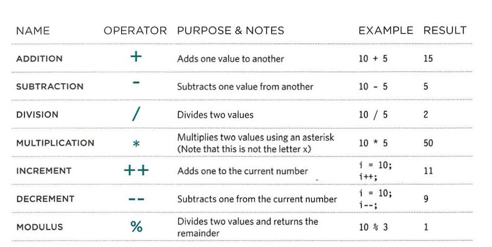
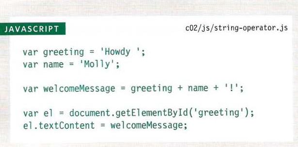
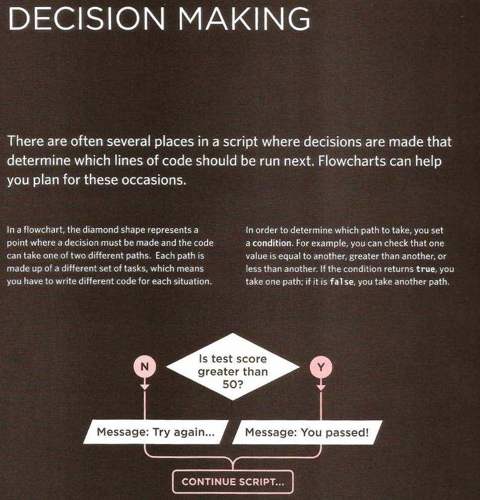

# TEXT 
## Headings
- HTML has six "levels" of
headings:
- h1 is used for main headings
- h2 is used for subheadings
If there are further sections
under the subheadings then the
- h3 element is used, and so
on...
## Paragraphs
- To create a paragraph, surround
the words that make up the
paragraph with an opening p
tag and closing p tag 
## Bold & Italic 
- b
By enclosing words in the tags
b (open  tag) and </b> (close tag) we can make
characters appear bold.
- The b element also represents
a section of text that would be
presented in a visually different
way (for example key words in a
paragraph) although the use of
the b element does not imply
any additional meaning. 

- By enclosing words in the tags
i  (open  tag) and </i> we can make
characters appear italic.
- The i element also represents
a section of text that would be
said in a different way from
surrounding content — such as
technical terms, names of ships,
foreign words, thoughts, or other
terms that would usually be
italicized. 
## Superscript & Subscript 

### The sup element is used
to contain characters that
should be superscript such
as the suffixes of dates or
mathematical concepts like
raising a number to a power such
as 22.

### The sub element is used to
contain characters that should
be subscript. It is commonly
used with foot notes or chemical
formulas such as H20.
## White Space 
- In order to make code easier to
read, web page authors often
add extra spaces or start some
elements on new lines.

- When the browser comes across
two or more spaces next to each
other, it only displays one space.
Similarly if it comes across a line
break, it treats that as a single
space too. This is known as
white space collapsing 
 ## Line Breaks & Horizontal Rules 
 ### br tag
- As you have already seen, the
browser will automatically show
each new paragraph or heading
on a new line. But if you wanted
to add a line break inside the
middle of a paragraph you can
use the line break tag br />. 
### hr  tag
- To create a break between
themes — such as a change of
topic in a book or a new scene
in a play — you can add a
horizontal rule between sections
using the hr  tag. 

## Visual Editors & Their Code views 
- Content management systems and HTML editors such as Dreamweaver
usually have two views of the page you are creating: a visual editor and a
code view. 
- Visual editors often resemble
word processors. Although
each editor will differ slightly,
there are some features that
are common to most editors
that allow you to control the
presentation of text. 
- Code views show you the code
created by the visual editor so
you can manually edit it, or so
you can just enter new code
yourself . 
## Semantic Markup 
- There are some text elements that are not intended to affect the
structure of your web pages, but they do add extra information to the
pages — they are known as semantic markup 
## Strong & Emphasis 
### strong element
- The use of the strong
element indicates that its
content has strong importance.
For example, the words
contained in this element might
be said with strong emphasis.

- By default, browsers will show
the contents of a strong
element in bold. 
### em elemet
- The em element indicates
emphasis that subtly changes
the meaning of a sentence.
- By default browsers will show
the contents of an em element
in italic. 
## Quotations 
- There are two elements
commonly used for marking up
quotations:
1. blockquote element 
- The blockquote element is
used for longer quotes that take
up an entire paragraph. Note
how the p element is still
used inside the blockquote
element. 
2. q
The q element is used for
shorter quotes that sit within
a paragraph. 
- Browsers are
supposed to put quotes around
the q element, however
Internet Explorer does not —
therefore many people avoid
using the q element. 
## Abbreviations & Acronyms 
### abbr element
- If you use an abbreviation or
an acronym, then the abbr
element can be used. A title
attribute on the opening tag is
used to specify the full term.  
## Citations & Definitions
### cite element 
- When you are referencing a
piece of work such as a book,
film or research paper, the
cite element can be used
to indicate where the citation is
from. 
### dfn element 
- The first time you explain some
new terminology (perhaps an
academic concept or some
jargon) in a document, it is
known as the defining instance
of it.
- The dfn element is used to
indicate the defining instance of
a new term.
## Author Details
### address element 
- The address element has
quite a specific use: to contain
contact details for the author of
the page. 
## Changes to Content 
### ins and del element
- The ins element can be used
to show content that has been
inserted into a document, while
the del element can show text
that has been deleted from it. 
### s element
- The s element indicates
something that is no longer
accurate or relevant (but that
should not be deleted).
- Visually the content of an s
element will usually be displayed
with a line through the center. 
## Summary 
- HTML elements are used to describe the structure of
the page (e.g. headings, subheadings, paragraphs). 
- They also provide semantic information (e.g. where
emphasis should be placed, the definition of any
acronyms used, when given text is a quotation). 
# CSS 

## What is CSS?
-  CSS is the language for describing the presentation of Web pages, including colors, layout, and fonts. It allows one to adapt the presentation to different types of devices, such as large screens, small screens, or printers. CSS is independent of HTML and can be used with any XML-based markup language. 
## How CSS works
- When a browser displays a document, it must combine the document's content with its style information. It processes the document in a number of stages, which we've listed below. Bear in mind that this is a very simplified version of what happens when a browser loads a webpage, and that different browsers will handle the process in different ways. But this is roughly what happens. 
##  Rules, properties, and values
- A CSS property styles an aspect of an HTML element. Here are a few examples:

- A CSS property declaration consists of a property name and a property value. The property name comes first, then a colon, and then the value. Here is the general pattern a CSS property declaration follows:

property-name : property-value
If you specify more than one CSS property, the each name - value pair is separated by a semicolon, like this:

property1 : property-value1;
property2 : property-value2;
- The last property declaration does not have to end with a semicolon, but it makes it easier to add more CSS properties without forgetting to put in that extra semicolon.

- There are many CSS properties you can specify for different HTML elements. These CSS properties are covered in their own texts.

 - CSS Rules
A CSS rule is a grouping of one or more CSS properties which are to be applied to one or more target HTML elements.

- A CSS rule consists of a CSS selector and a set of CSS properties. The CSS selector determines what HTML elements to target with the CSS rule. The CSS properties specifies what to style of the targeted HTML elements

# Basic JavaScript Instructions 
## STATEMENTS 
- A script is a series of instructions that a computer can follow one-by-one.
Each individual instruction or step is known as a statement , Statements should end with a semicolon. 
## COMMENTS
- You should write comments to explain what your code does.
They help make your code easier to read and understand.
This can help you and others who read your code. 
## WHAT IS A VARIABLE?
- A script will have to temporarily
store the bits of information it
needs to do its job. It can store this
data in variables.
## Variables : how to declare them 
 
## Variables : how to declare them a value 

## DATA TYPES 
- JavaScript distinguishes between numbers,
strings, and true or false values known as
Booleans. 

## USING A VARIABLE TO STORE A NUMBER 

## USING A VARIABLE TO STORE A STRING 

## USING QUOTES INSIDE A STRING 

## USING A VARIABLE TO STORE A BOOLEAN 

## SHORTHAND FOR CREATING VARIABLES 

## CHANGING THE VALUE OF A VARIABLE 
 
## RULES FOR NAMING VARIABLES 
1. The name must begin with
a letter, dollar sign ($),or an
underscore (_). It must not start
with a number.
2. The name can contain letters,
numbers, dollar sign ($), or an
underscore (_). Note that you
must not use a dash(-) or a
period (.) in a variable name.
3. You cannot use keywords or
reserved words. Keywords
are special words that tell the
interpreter to do something. For
example, var is a keyword used
to declare a variable. Reserved
words are ones that may be used
in a future version of JavaScript.
ONLINE EXTRA
View a full list of keywords and
reserved words in JavaScript.
4. All variables are case sensitive,
so score and Score would be
different variable names, but
it is bad practice to create two
variables that have the same
name using different cases.
5. Use a name that describes the
kind of information that the
variable stores. For example,
fi rstName might be used to
store a person's first name,
l astNarne for their last name,
and age for their age.
6. If your variable name is made
up of more than one word, use a
capital letter for the first letter of
every word after the first word.
For example, f i rstName rather
than fi rstnarne (this is referred
to as camel case). You can also
use an underscore between each
word (you cannot use a dash). 
## ARRAYS
- An array is a special type of variable. It doesn't
just store one value; it stores a list of values.  
## CREATING AN ARRAY 

## VALUES IN ARRAYS
- Values in an array are accessed as if they are in
a numbered list. It is important to know that the
numbering of this list starts at zero (not one).
## ACCESSING & CHANGING VALUES IN AN ARRAY
 
## EXPRESSIONS 

## OPERATORS 
- Expressions rely on things called operators; they allow programmers to
create a single value from one or more values. 
## ARITHMETIC OPERATORS
- JavaScript contains the following mathematical
operators, which you can use with numbers.
You may remember some from math class.

## USING ARITHMETIC OPERATORS 

## STRING OPERATOR 
- There is just one string operator: the+ symbol.
It is used to join the strings on either side of it. 
## USING S'TRING OPERATORS 
 

# Decisions and Loops 
 
 

 
## USING COMPARISON OPERATORS 

## COMPARING TWO EXPRESSIONS 
 
## logical opeartar 

 
## USING LOGICAL AND 
 
## USING LOGICAL OR & LOGICAL NOT 
 

## USING IF STATEMENTS 
 
