# list

- There are lots of occasions when we
need to use lists. HTML provides us with
three different types:

1. Ordered lists are lists where each item in the list is
numbered. For example, the list might be a set of steps for
a recipe that must be performed in order, or a legal contract
where each point needs to be identified by a section
number.
2. Unordered lists are lists that begin with a bullet point
(rather than characters that indicate order).
3. Definition lists are made up of a set of terms along with the
definitions for each of those terms.
4. nested Lists You can put a second list inside
an li element to create a sublist or nested list

- Ordered lists

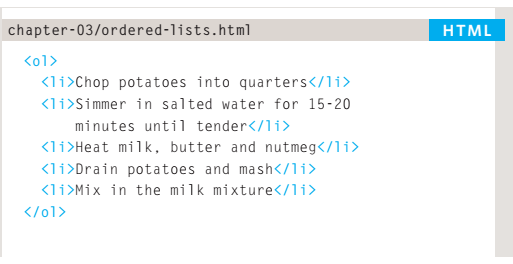

- Unordered lists

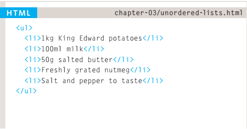

- Definition lists

1. dl tag
 The definition list is created with
the dl element and usually
consists of a series of terms and
their definitions.
Inside the dl element you will
usually see pairs of dt and
dd elements.
2. dt tag
This is used to contain the term
being defined (the definition
term).
3. dd tag
This is used to contain the
definition.

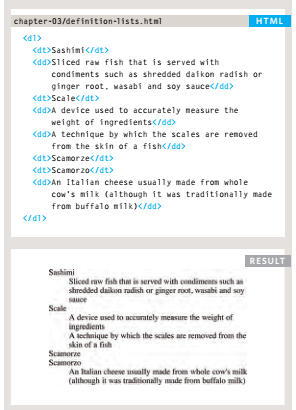

- nested Lists

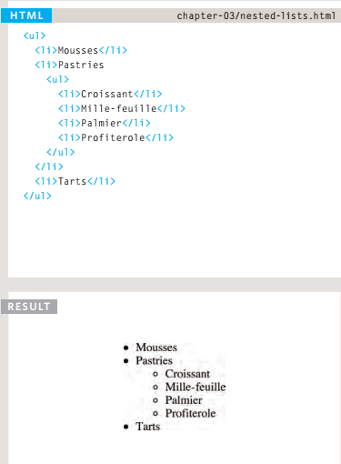

# Boxes

## Box Dimensions

- By default a box is sized just big
enough to hold its contents. To
set your own dimensions for a
box you can use the height and
width properties.
- The most popular ways to
specify the size of a box are
to use pixels, percentages, or
ems .
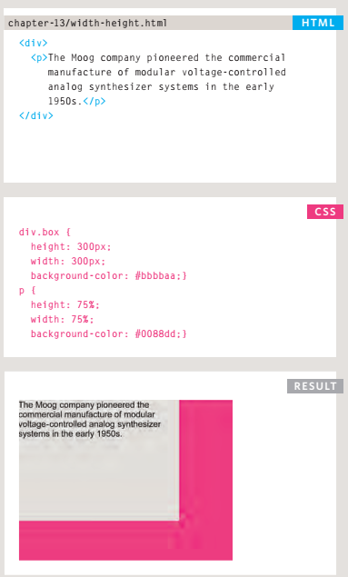

### limiting Width

- Some page designs expand and
shrink to fit the size of the user's
screen. In such designs, the
min-width property specifies
the smallest size a box can be
displayed at when the browser
window is narrow, and the
max-width property indicates
the maximum width a box can
stretch to when the browser
window is wide.

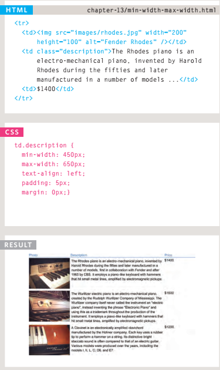

### Limiting height

- In the same way that you might
want to limit the width of a box
on a page, you may also want
to limit the height of it.
- This is achieved using the min-height
and max-height properties.

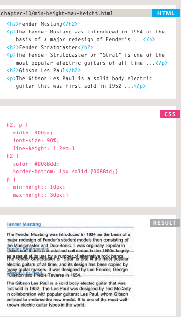

### overflow

- The overflow property tells the
browser what to do if the content
contained within a box is larger
than the box itself. It can have
one of two values:

1. hidden
This property simply hides any
extra content that does not fit in
the box.
2. scroll
This property adds a scrollbar to
the box so that users can scroll
to see the missing content .
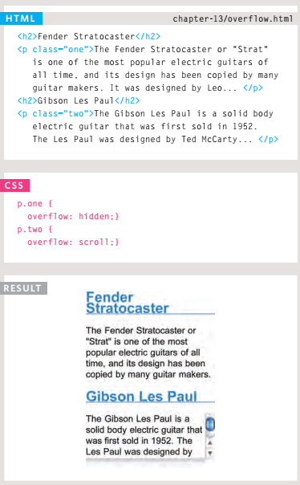

## BORDER , MARGIN & PADDING

 Every box has three available properties that
can be adjusted to control its appearance:

1. BORDER
 Every box has a border (even if
it is not visible or is specified to
be 0 pixels wide). The border
separates the edge of one box
from another
2. MARGIN
Margins sit outside the edge
of the border. You can set the
width of a margin to create a
gap between the borders of two
adjacent boxes
3. PADDING
Padding is the space between
the border of a box and any
content contained within it .

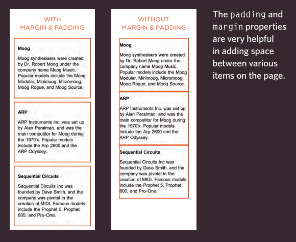

## border-width

- The border-width property
is used to control the width
of a border. The value of this
property can either be given
in pixels or using one of the
following values:

1. thin
2. medium
3. thick

- (You cannot use percentages
with this property.)
- You can control the individual
size of borders using four
separate properties:

1. border-top-width
2. border-right-width
3. border-bottom-width
4. border-left-width

- You can also specify different
widths for the four border values
in one property, like so:
border-width: 2px 1px 1px
2px;
- The values here appear in
clockwise order: top, right,
bottom, left.

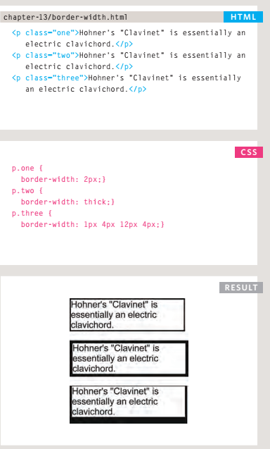

- you can style your border like size , color  

### short hanD border

- The border property allows you
to specify the width, style and
color of a border in one property
(and the values should be coded
in that specific order).

### padding

- The padding property allows
you to specify how much space
should appear between the
content of an element and its
border.

### margin

-The margin property controls
the gap between boxes. Its value
is commonly given in pixels,
although you may also use
percentages or ems.

- you can  centering contact bt text-align

## IE6 Box model

- When you specify the width of
a box, any padding or margin
should be added to the width of
it. Internet Explorer 6, however,
has a quirk whereby it includes
the padding and margins in the
width of the box.

-you can change inline / block  by display : inline , none ...

- you can hiding boxes  by visibility : hidden , visible 

### border-image

- The border-image property applies an image to the border of
any box. It takes a background
image and slices it into nine
pieces .

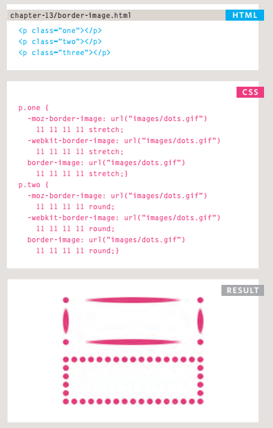

### box-shadow

- The box-shadow property
allows you to add a drop shadow
around a box. It works just like
the text-shadow property that
you met on page 288. 
- It must use at least the first of these two
values as well as a color:

1. horizontAl offset
Negative values position the
shadow to the left of the box.
2. verticAl offset
Negative values position the
shadow to the top of the box.
3. Blur DistAnce
If omitted, the shadow is a solid
line like a border.
4. sPread of shadoW
If used, a positive value will
cause the shadow to expand in
all directions, and a negative
value will make it contract.

### border-radius

- CSS3 introduces the ability to
create rounded corners on any
box, using a property called
border-radius. The value
indicates the size of the radius
in pixels
- To create more complex shapes,
you can specify different
distances for the horizontal and
the vertical parts of the rounded
corners.

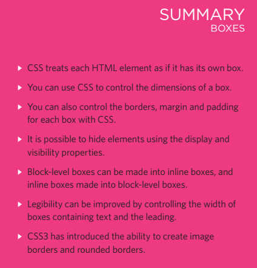

# Basic JavaScript Instructions

## ARRAYS

- An array is a special type of variable. It doesn't
just store one value; it stores a list of values.
- You should consider using an
array whenever you are working
with a list or a set of values that
are related to each other.

## CREATING AN ARRAY

-You create an array and give it
a name just like you would any
other variable (using the var
keyword followed by the name of
the array).

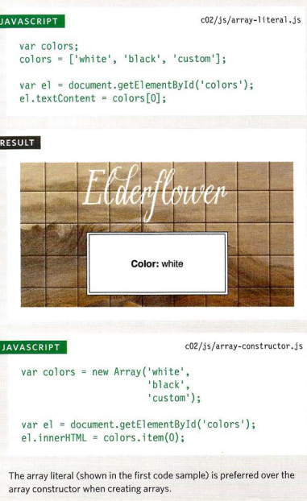

## VALU ES IN ARRAYS

- Values in an array are accessed as if they are in
a numbered list. It is important to know that the
numbering of this list starts at zero (not one).

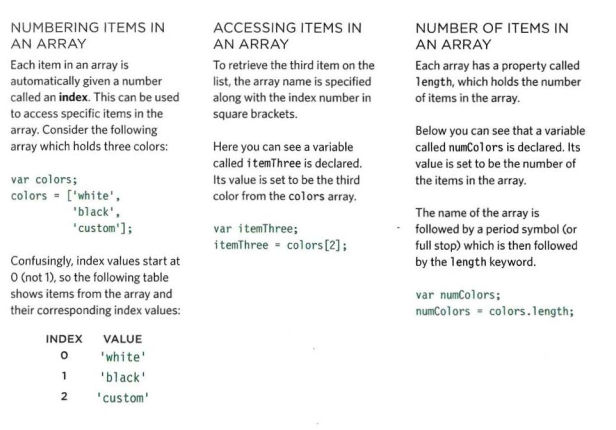

## ACCESSING & CHANGING VALUES IN AN ARRAY

- The first lines of code on the left
create an array containing a list
of three colors. (The values can
be added on the same line or on
separate lines as shown here.)
- Having created the array, the
third item on the list is changed
from 'custom' to 'beige'.
- To access a value from an array,
after the array name you specify
the index number for that value
inside square brackets.

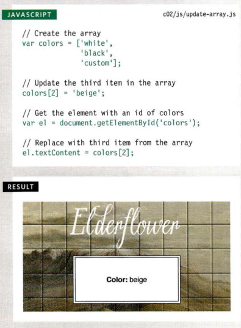

# Decisions and Loops

## IF else statment

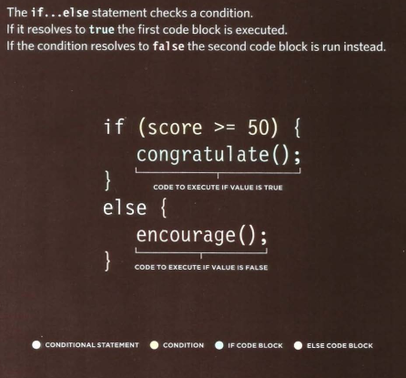

## USING IF... ELSE STATEMENTS

- if...e1se statement allows you
to provide two sets of code:

1. one set if the condition
evaluates to true
2. another set if the condition is
false

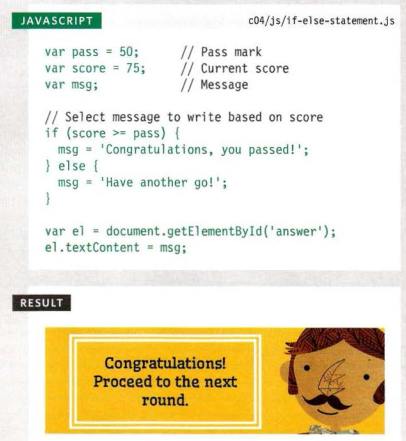

## SWITCH STATEMENTS

- A switch statement starts with a
variable called the switch value.
Each case indicates a possible
value for this variable and the
code that should run if the
variable matches that value.

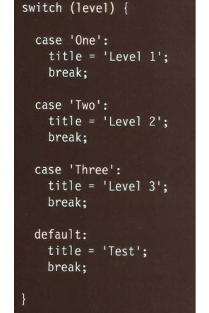

## IF ELSE Vs Switch

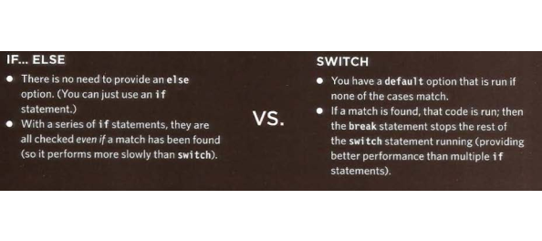

## USING SWITCH STATEMENTS

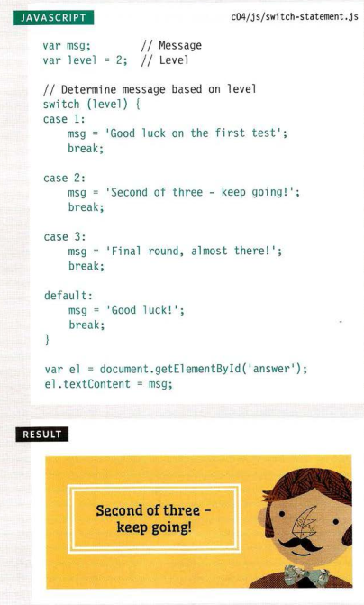

## TYPE COERCION & WEAK TYPING

- If you use a data type JavaScript did not expect,
it tries to make sense of the operation rather
than report an error.

## TRUTHY & FALSY VALUES

- Due to type coercion, every value in JavaScript
can be treated as if it were true or false; and
this has some interesting side effects

- Falsy values are treated as ifthey
are fa1se. The table to the left
shows a hi ghScore variable with
a series of values, all of which
are falsy , Falsy values can also be treated
as the number 0 
- Truthy values are treated as if
they are true. Almost everything
that is not in the falsy table can
be treated as if it were true , Truthy values can also be treated
as the number 1. 

## CHECKING EQUALITY & EXISTENCE

- Because the presence of an object or array can
be considered truthy, it is often used to check
for the existence of an element within a page.

## SHORT CIRCUIT VALUES

- Logical operators are processed left to right.
They short-circuit (stop) as soon as they have a
result - but they return the value that stopped
the processing (not necessarily true or fa1se).

## lOOPS

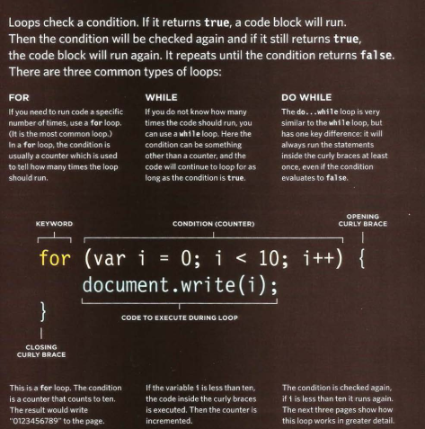

## loop counter

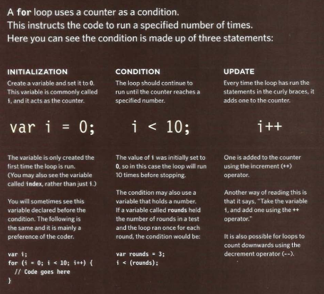

## KEY LOOP CONCEPTS

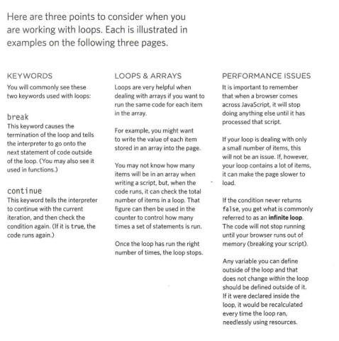

## USING FOR LOOPS

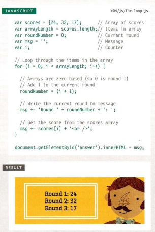

## USING WHILE LOOPS

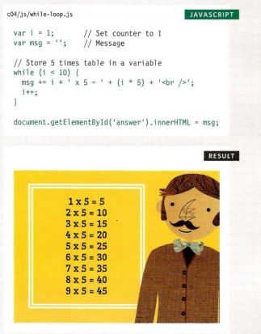

## USING DO WHILE LOOPS

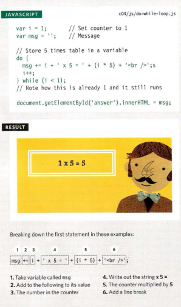

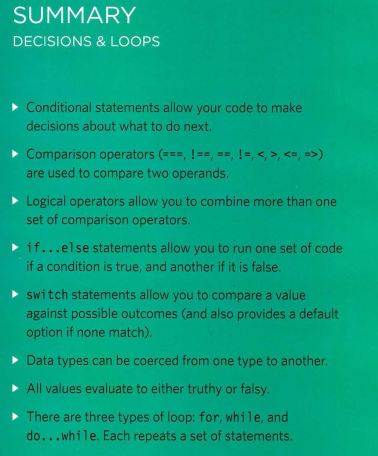