# links

- Links are the defining feature of the web
because they allow you to move from
one web page to another .

## Writing Links

- Links are created using the a element. Users can click on anything
between the opening  a  tag and the closing a tag. You specify
which page you want to link to using the href attribute.

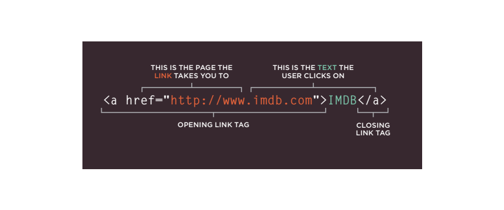

- The text between the opening
a tag and closing a tag
is known as link text.

## Linking to other sites

- Links are created using the a
element which has an attribute
called href. The value of the
href attribute is the page that
you want people to go to when
they click on the link.

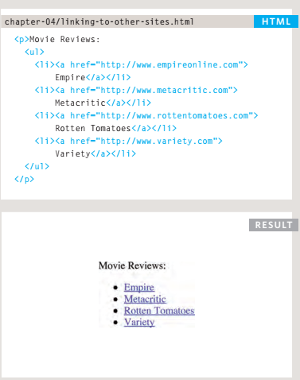

## Linking to other Pages on the sAme site

- When you are linking to other
pages within the same site,
you do not need to specify the
domain name in the URL. You
can use a shorthand known as a
relative URL.
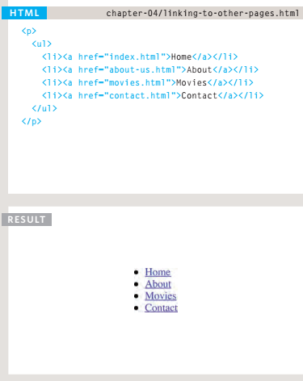

## Directory structure

- structure
The diagram on the right shows
the directory structure for a
fictional entertainment listings
website called ExampleArts.
- reLAtionshiPs
The relationship between
files and folders on a website
is described using the same
terminology as a family tree.
- homePAges
The main homepage of a site
written in HTML (and the
homepages of each section in a
child folder) is called index.html.

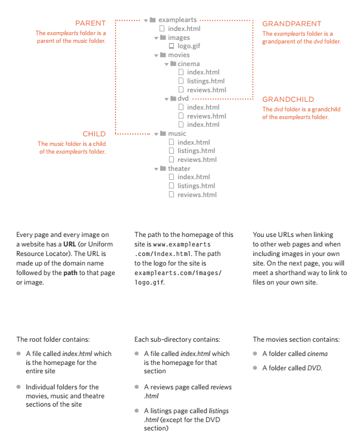

## reLAtive urLs

- Relative URLs can be used when linking to pages within your own
website. They provide a shorthand way of telling the browser where to
find your files.

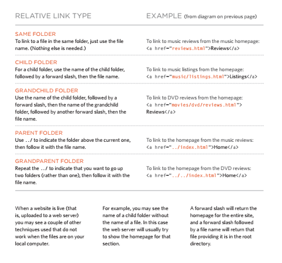

## emAiL Links

- mailto
To create a link that starts up
the user's email program and
addresses an email to a specified
email address, you use the a
element. However, this time the
value of the href attribute starts
with mailto: and is followed by
the email address you want the
email to be sent to.

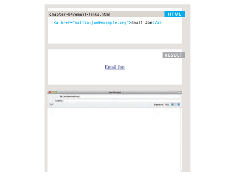

## oPening Links in A neW WinDoW

- target
If you want a link to open in a
new window, you can use the
target attribute on the opening
a tag. The value of this
attribute should be _blank.

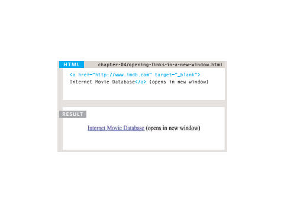

## Linking to A sPeciFic PArt oF the sAme PAge

- At the top of a long page
you might want to add a list
of contents that links to the
corresponding sections lower
down. Or you might want to add
a link from part way down the
page back to the top of it to save
users from having to scroll back
to the top .

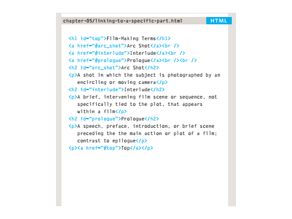

## Linking to A sPeciFic PArt oF Another PAge

- If you want to link to a specific
part of a different page (whether
on your own site or a different
website) you can use a similar
technique.
- As long as the page you are
linking to has id attributes that
identify specific parts of the
page, you can simply add the
same syntax to the end of the
link for that page.

# Layout

## Key ConCepts in positioning eLements

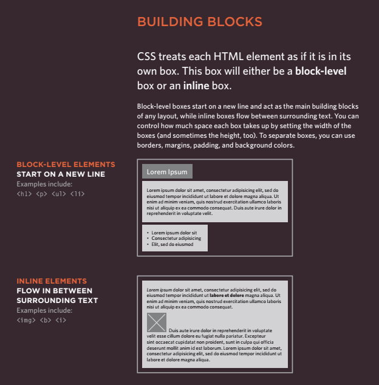

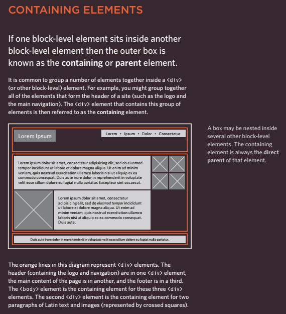

## ControLLing the position of eLements

- CSS has the following positioning schemes that allow you to control
the layout of a page: normal flow, relative positioning, and absolute
positioning. You specify the positioning scheme using the position
property in CSS. You can also float elements using the float property.

- To indicate where a box should be positioned, you may also need to use
box offset properties to tell the browser how far from the top or bottom
and left or right it should be placed.

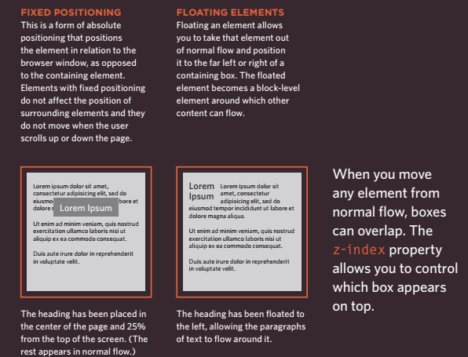

## normaL fLow

- In normal flow, each block-level
element sits on top of the next
one. Since this is the default
way in which browsers treat
HTML elements, you do not
need a CSS property to indicate
that elements should appear
in normal flow, but the syntax
would be:
position: static;

## reLative positioning

- Relative positioning moves an
element in relation to where it
would have been in normal flow.
- For example, you can move it 10
pixels lower than it would have
been in normal flow or 20% to
the right.

## absoLute positioning

- When the position property
is given a value of absolute,
the box is taken out of normal
flow and no longer affects the
position of other elements on
the page. (They act like it is not
there.)
- The box offset properties (top
or bottom and left or right)
specify where the element
should appear in relation to its
containing element

## fixed positioning

 position:fixed

- Fixed positioning is a type
of absolute positioning that
requires the position property
to have a value of fixed.
It positions the element in
relation to the browser window.
Therefore, when a user scrolls
down the page, it stays in the
exact same place. It is a good
idea to try this example in your
browser to see the effect.

## overLapping eLements

z-index

- If you want to control which
element sits on top, you can use
the z-index property. Its value
is a number, and the higher the
number the closer that element
is to the front. For example, an
element with a z-index of 10
will appear over the top of one
with a z-index of 5.

## fLoating eLements

- The float property allows you
to take an element in normal
flow and place it as far to the
left or right of the containing
element as possible.

## using fLoat to pLaCe eLements side-by-side 

- A lot of layouts place boxes
next to each other. The float
property is commonly used to
achieve this.
When elements are floated, the
height of the boxes can affect
where the following elements sit.

## CLearing fLoats

- The clear property allows you
to say that no element (within
the same containing element)
should touch the left or righthand sides of a box. It can take
the following values:

1. left
The left-hand side of the box
should not touch any other
elements appearing in the same
containing element.
2. right
The right-hand side of the
box will not touch elements
appearing in the same containing
element.
3. both
Neither the left nor right-hand
sides of the box will touch
elements appearing in the same
containing element.
4. none
Elements can touch either side.
In this example, the fourth
paragraph has a class called
clear. The CSS rule for this
class uses the clear property
to indicate that nothing should
touch the left-hand side of it. The
fourth paragraph is therefore
moved further down the page
so no other element touches its
left-hand side.

## parents of fLoated eLements: probLem

- If a containing element only
contains floated elements, some
browsers will treat it as if it is
zero pixels tall.
As you can see in this example,
the one pixel border assigned
to the containing element has
collapsed, so the box looks like a
two pixel line.

## parents of fLoated eLements: soLution

- Traditionally, developers got
around this problem by adding
an extra element after the
last floated box (inside the
containing element). A CSS
rule would be applied to this
additional element setting the
clear property to have a value
of both. But this meant that an
extra element was added to the
HTML just to fix the height of the
containing element.
More recently, developers have
opted for a purely CSS-based
solution because it means that
there is no need to add an extra
element to the HTML page after
the floated elements. The pure
CSS solution adds two CSS rules
to the containing element (in this
example the div element):
● The overflow property is
given a value auto.
● The width property is set to
100%.

## Creating muLti-CoLumn Layouts with fLoats

- Many web pages use multiple
columns in their design. This
is achieved by using a div
element to represent each
column. The following three CSS
properties are used to position
the columns next to each other:

1. width
This sets the width of the
columns.
2. float
This positions the columns next
to each other.
3. margin
This creates a gap between the
columns.

- A two-column layout like the one
shown on this page would need
two div elements, one for the
main content of the page and
one for the sidebar.
- Inside each of the div
elements there can be headings,
paragraphs, images, and even
other div elements.

## sCreen sizes

- Different visitors to your site will have different sized screens that show
different amounts of information, so your design needs to be able to
work on a range of different sized screens.

## sCreen resoLution

- Resolution refers to the number of dots a screen shows per inch. Some
devices have a higher resolution than desktop computers and most
operating systems allow users to adjust the resolution of their screens.

## page sizes

- Because screen sizes and display resolutions vary so much, web
designers often try to create pages of around 960-1000 pixels wide
(since most users will be able to see designs this wide on their screens).

## fixed width Layouts

- Fixed width layout
designs do not
change size as the
user increases
or decreases
the size of their
browser window.
Measurements tend
to be given in pixels.

- advantages

1. Pixel values are accurate
at controlling size and
positioning of elements.
2. The designer has far greater
control over the appearance
and position of items on the
page than with liquid layouts.
3. You can control the lengths
of lines of text regardless of
the size of the user's window.
4. The size of an image will
always remain the same
relative to the rest of the
page.

- disadvantages

1. You can end up with big gaps
around the edge of a page.
2. If the user's screen is a much
higher resolution than the
designer's screen, the page
can look smaller and text can
be harder to read.
3. If a user increases font sizes,
text might not fit into the
allotted spaces.
4. The design works best on
devices that have a site or
resolution similar to that of
desktop or laptop computers.
5. The page will often take up
more vertical space than a
liquid layout with the same
content.

## Liquid Layouts

- Liquid layout designs
stretch and contract
as the user increases
or decreases the
size of their browser
window. They tend to
use percentages.

- advantages

1. Pages expand to fill the entire
browser window so there are
no spaces around the page
on a large screen.
2. If the user has a small
window, the page can
contract to fit it without the
user having to scroll to the
side.
3. The design is tolerant of
users setting font sizes larger
than the designer intended
(because the page can
stretch).

- disadvantages

1. If you do not control the
width of sections of the page
then the design can look very
different than you intended,
with unexpected gaps around
certain elements or items
squashed together.
2. If the user has a wide
window, lines of text can
become very long, which
makes them harder to read.
3. If the user has a very narrow
window, words may be
squashed and you can end up
with few words on each line.
4. If a fixed width item (such as
an image) is in a box that is
too small to hold it (because
the user has made the
window smaller) the image
can overflow over the text.

## fixed width Layout

- To create a fixed width layout,
the width of the main boxes on
a page will usually be specified
in pixels (and sometimes their
height, too).

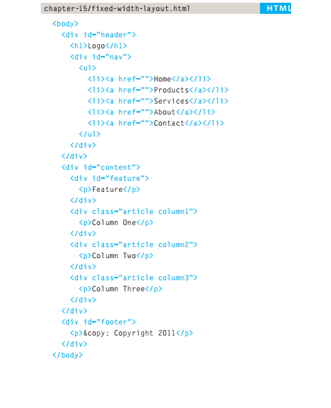
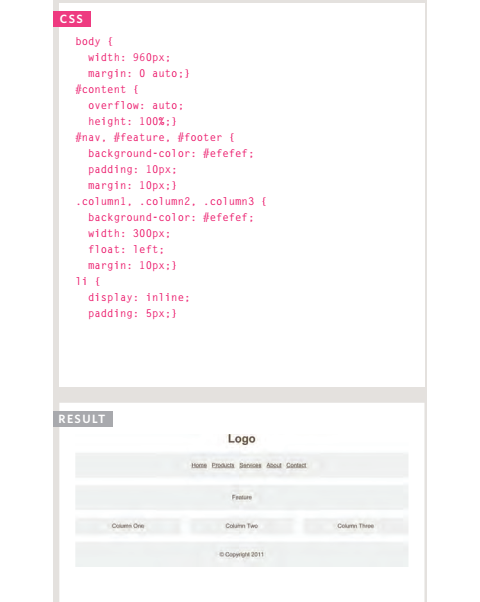

## A Liquid Layout

- The liquid layout uses
percentages to specify the width
of each box so that the design
will stretch to fit the size of the
screen.

## Layout grids

- Composition in any visual art (such as design, painting, or photography)
is the placement or arrangement of visual elements — how they are
organized on a page. Many designers use a grid structure to help them
position items on a page, and the same is true for web designers.

## Css frameworKs

- CSS frameworks aim to make your life easier by providing the code for
common tasks, such as creating layout grids, styling forms, creating
printer-friendly versions of pages and so on. You can include the CSS
framework code in your projects rather than writing the CSS from scratch.

- advantages

1. They save you from
repeatedly writing code for
the same tasks.
2. They will have been tested
across different browser
versions (which helps avoid
browser bugs).

- disadvantages

1. They often require that you
use class names in your
HTML code that only control
the presentation of the page
(rather than describe its
content).
2. In order to satisfy a wide
variety of needs, they often
contain more code than you
need for your particular web
page (commonly referred to
as code “bloat”).

## grid-based Layout using 960.gs

- Let's take a look at an HTML
page and how it has been
marked up to use the 960.gs grid
system.
- You can see that we include
the CSS for the grid using the
link element inside the
head of the page.
- The styles we are writing
ourselves are shown on the right
hand page.

## muLtipLe styLe sheets @import

- Some web page authors split
up their CSS style rules into
separate style sheets. For
example, they might use one
style sheet to control the layout
and another to control fonts,
colors and so on.
- Some authors take an even
more modular approach
to stylesheets, creating
separate stylesheets to control
typography, layout, forms,
tables, even different styles for
each sub-section of a site.
- There are two ways to add
multiple style sheets to a page:

1. Your HTML page can link
to one style sheet and that
stylesheet can use the @import
rule to import other style sheets.

2. In the HTML you can use a
separate link element for
each style sheet.

## muLtipLe styLe sheets link

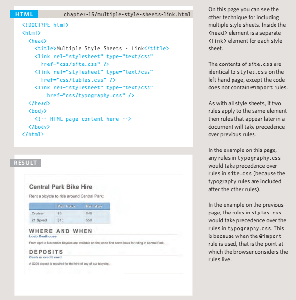

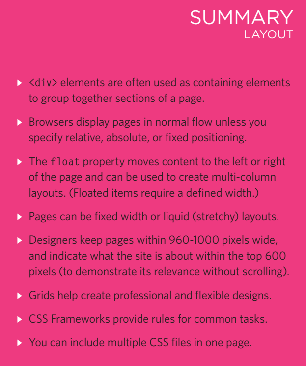

# Functions, Methods, and Objects

- Browsers require very detailed instructions about what
we want them to do. Therefore, complex scripts can run
to hundreds (even thousands) of lines. Programmers use
functions, methods, and objects to organize their code.
This chapter is divided into three sections that introduce:

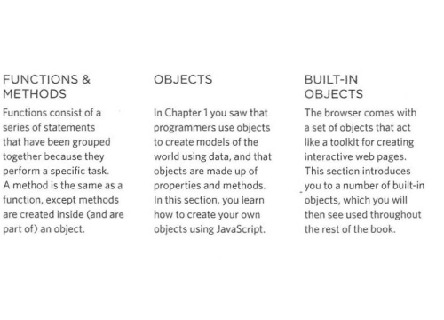

## WHAT IS A FUNCTION?

- Functions let you group a series of statements together to perform a
specific task. If different parts of a script repeat the same task, you can
reuse the function (rather than repeating the same set of statements).

## A BASIC FUNCTION

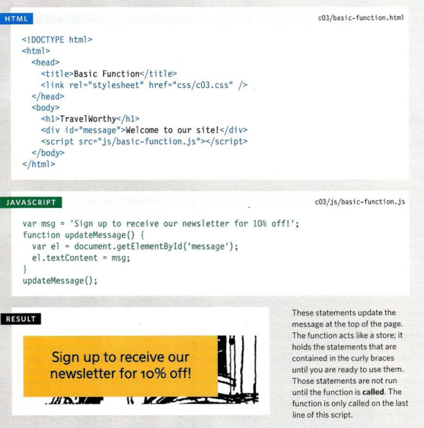

## declearing a function

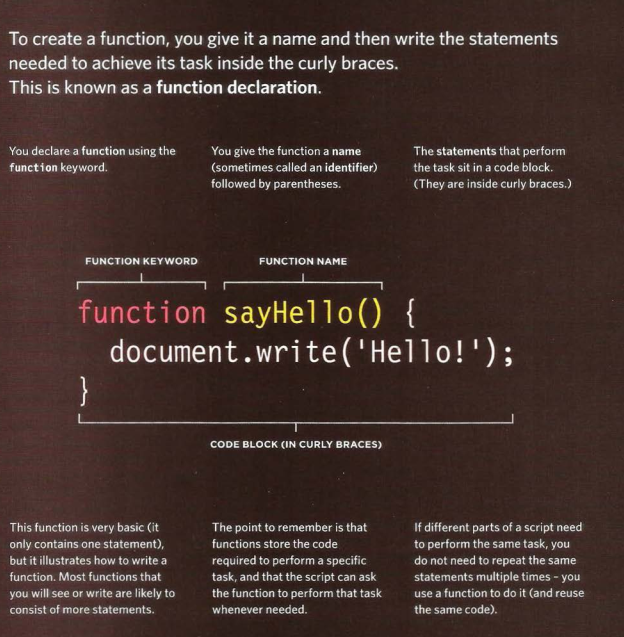

## calling a funtion

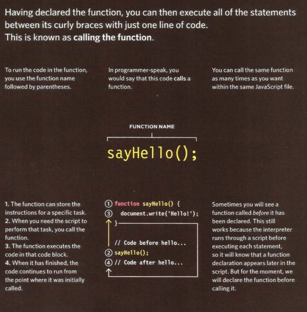

## declearing a funtion taht need information

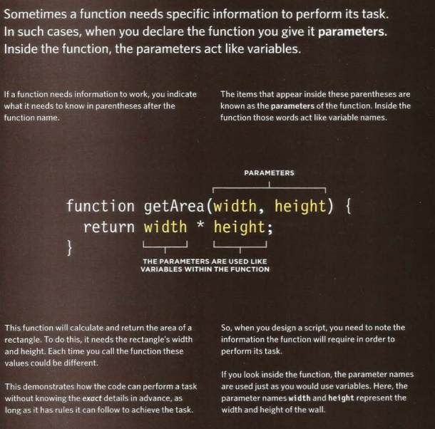

## calling a funtion taht need informatio

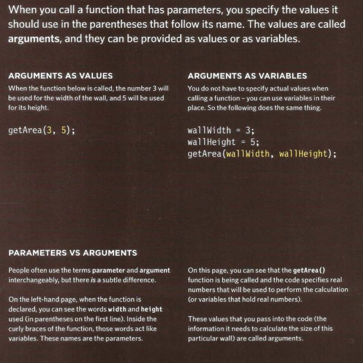

## getting a single value out of a function

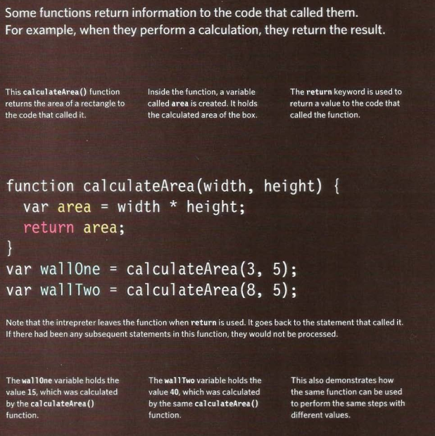

## getting a mutilple value out of a function

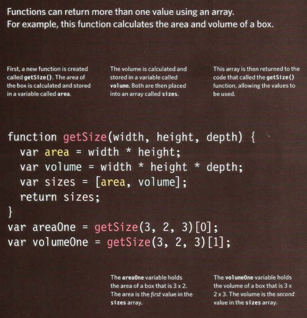

## ANONYMOUS FUNCTIONS & FUNCTION EXPRESSIONS

- Expressions produce a value, They can be used where values are expected.
If a function is placed where a browser expects to see an expression,
(e.g., as an argument to a function), then it gets treated as an expression.

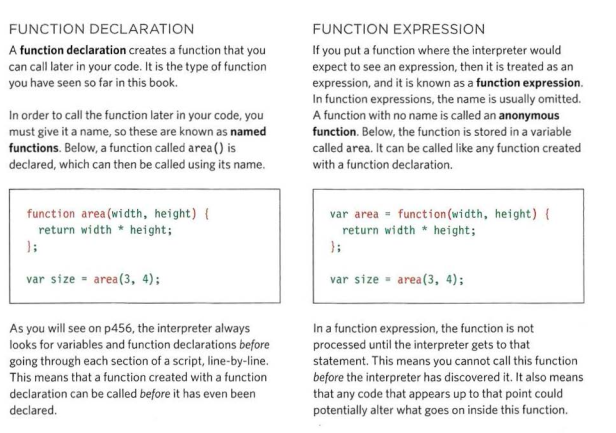

## IMMEDIATELY INVOKED FUNCTION EXPRESSIONS

- This way of writing a function is used in several different situations.
Often functions are used to ensure that the variable names do not conflict
with each other (especially if the page uses more than one script)

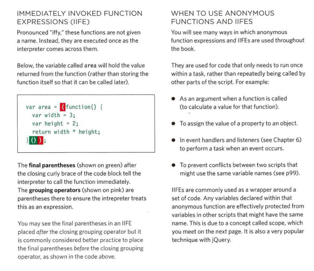

## VARIABLE SCOPE

- The location where you declare a variable will affect where it can be used
within your code. If you declare it within a function, it can only be used
within that function. This is known as the variable's scope.

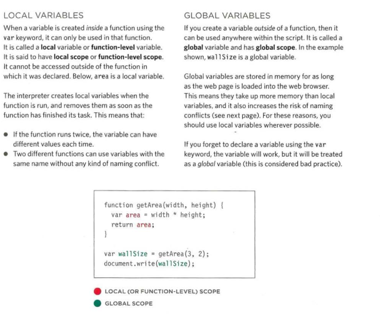

## HOW MEMORY & VARIABLES WORK

- Global variables use more memory. The browser has to remember them
for as long as the web page using them is loaded. Local variables are only
remembered during the period of time that a function is being executed.

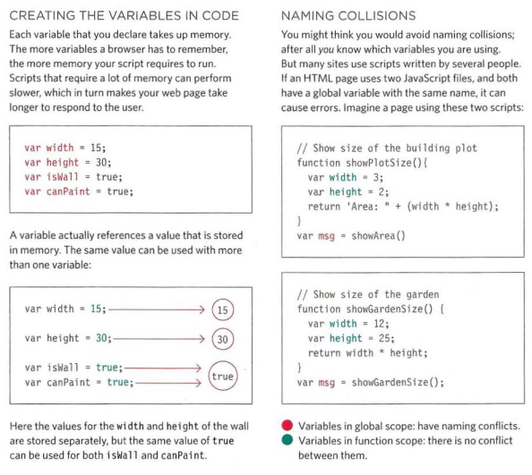

# 6 Reasons for Pair Programming

 1. Greater efficiency
 2. Engaged collaboration
 3. Learning from fellow students
 4. Social skills
 5. Job interview readiness
 6. Work environment readiness