# Images

- There are many reasons why you might
want to add an image to a web page: you
might want to include a logo, photograph,
illustration, diagram, or chart.

## ChoosIng Images for Your site

- A picture can say a thousand words, and great
images help make the difference between an
average-looking site and a really engaging one.

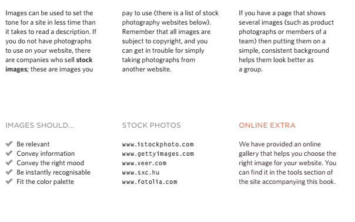

## storing Images on Your site 

- If you are building a site from scratch, it is good
practice to create a folder for all of the images
the site uses.

## addIng Images

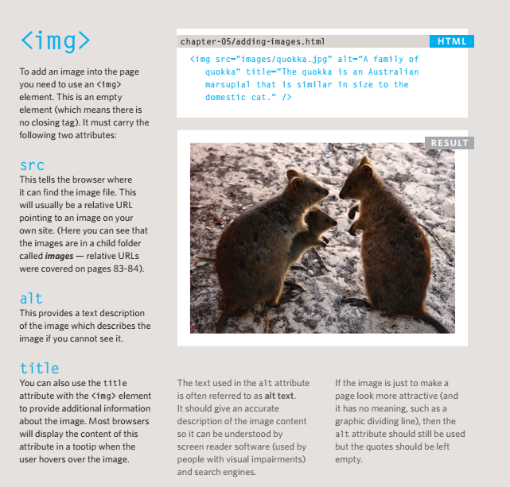

## height & width of Images

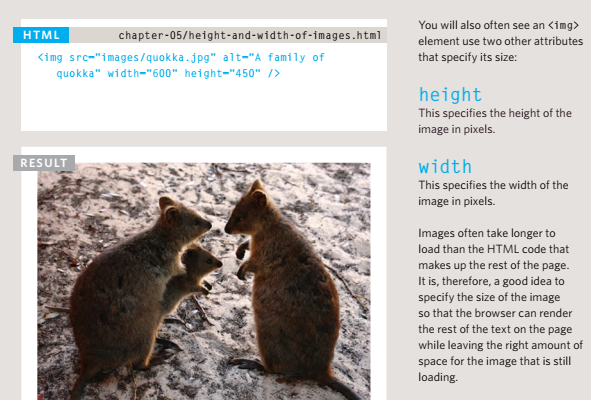

## Where to plaCe Images In Your Code

- Where an image is placed
in the code will affect how it
is displayed. Here are three
examples of image placement
that produce different results:

1. before a paragraph
The paragraph starts on a new
line after the image.
2. InsIde the start of a
paragraph
The first row of text aligns with
the bottom of the image.
3. In the mIddle of a
paragraph
The image is placed between the
words of the paragraph that it
appears in.

## old Code: alIgnIng Images horIzontallY

- align :
The align attribute was
commonly used to indicate how
the other parts of a page should
flow around an image. It has
been removed from HTML5
and new websites should use
CSS to control the alignment of
images.
- The align attribute can take
these horizontal values:

1. left
This aligns the image to the left
(allowing text to flow around its
right-hand side).
2. right
This aligns the image to the right
(allowing text to flow around its
left-hand side)

## old Code: alIgnIng Images VertICallY

- There are three values that the
align attribute can take that
control how the image should
align vertically with the text that
surrounds it:

1. top
This aligns the first line of the
surrounding text with the top of
the image.
2. middle
This aligns the first line of the
surrounding text with the middle
of the image.
3. bottom
This aligns the first line of the
surrounding text with the bottom
of the image.

## three rules for CreatIng Images

1. save Images In
the rIght format
Websites mainly use images in
jpeg, gif, or png format. If you
choose the wrong image
format then your image might
not look as sharp as it should
and can make the web page
slower to load.
2. save Images at
the rIght sIze
You should save the image at
the same width and height it will
appear on the website. If
the image is smaller than the
width or height that you have
specified, the image can be
distorted and stretched. If the
image is larger than the width
and height if you have specified,
the image will take longer to
display on the page.
3. use the CorreCt
resolutIon
Computer screens are made up
of dots known as pixels. Images
used on the web are also made
up of tiny dots. Resolution refers
to the number of dots per inch,
and most computer screens only
show web pages at 72 pixels
per inch. So saving images at
a higher resolution results in
images that are larger than
necessary and take longer to
download.

## tools to edIt & saVe Images

- There are several tools you can use to edit and
save images to ensure that they are the right
size, format, and resolution.
- The most popular tool amongst
web professionals is Adobe
Photoshop.

- Use GIF or PNG format
when saving images
with few colors or large
areas of the same color.

## Image dImensIons

- The images you use on your website should be
saved at the same width and height that you
want them to appear on the page.

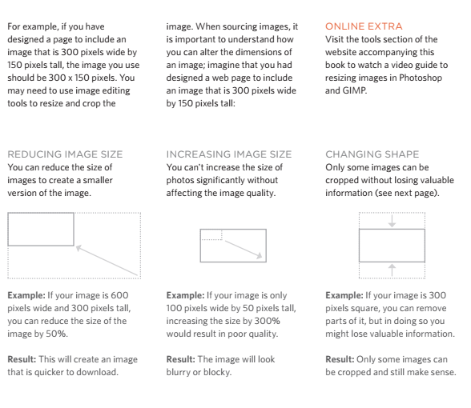

## CroppIng Images

- When cropping images it is important not to
lose valuable information. It is best to source
images that are the correct shape if possible.

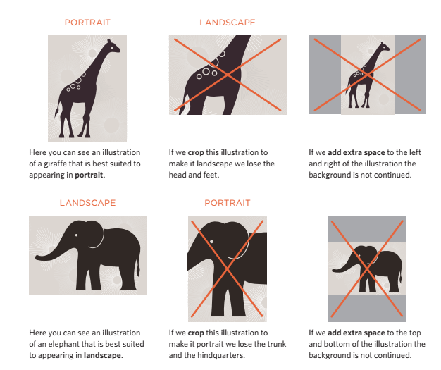

## Image resolutIon

- Images created for the web should be saved at
a resolution of 72 ppi. The higher the resolution
of the image, the larger the size of the file.

- JPGs, GIFs, and PNGs belong to
a type of image format known
as bitmap. They are made up of
lots of miniature squares. The
resolution of an image is the
number of squares that fit within
a 1 inch x 1 inch square area.

- Images appearing on computer
screens are made of tiny squares
called pixels. A small segment
of this photograph has been
magnified to show how it is
made up of pixels. The web
browsers on most desktop.

- computers display images at a
resolution of 72 pixels per inch
(ppi). Images in print materials
(such as books and magazines)
are made up of tiny circles called
dots. These images are usually
printed at a resolution of 300
dots per inch (dpi).

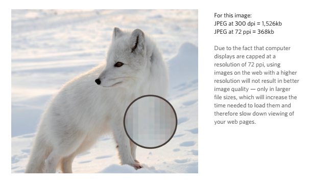

## VeCtor Images

- Vector images differ from bitmap images and
are resolution-independent. Vector images are
commonly created in programs such as Adobe
Illustrator.

## anImated gIfs

- Animated GIFs show several frames of an
image in sequence and therefore can be used to
create simple animations.

## transparenCY

- Creating an image that is partially transparent
(or "see-through") for the web involves
selecting one of two formats:

1. transparent gIf
If the transparent part of the
image has straight edges and
it is 100% transparent (that is,
not semi-opaque), you can save
the image as a GIF (with the
transparency option selected).
2. png
If the transparent part of the
image has diagonal or rounded
edges or if you want a semiopaque transparency or a dropshadow, then you will need to
save it as a PNG.

## HTML5: fIgure and fIgure CaptIon

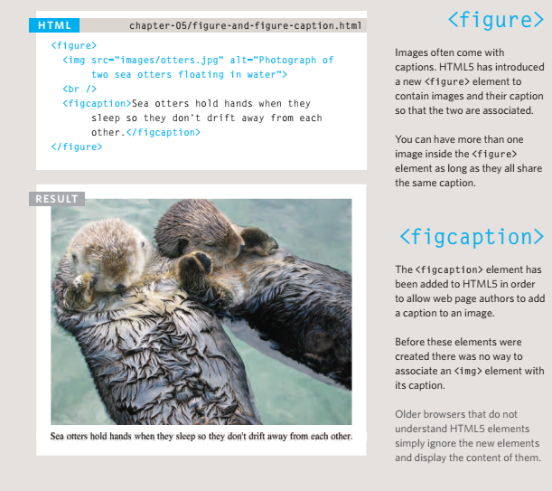

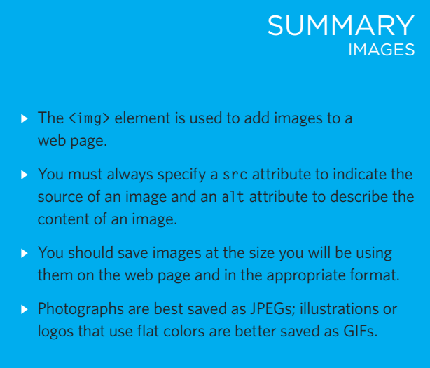

# Color

## Foreground Color

- The color property allows you
to specify the color of text inside
an element. You can specify any
color in CSS in one of three ways:

1. rgb values
These express colors in terms
of how much red, green and
blue are used to make it up. For
example: rgb(100,100,90)
2. hex Codes
These are six-digit codes that
represent the amount of red,
green and blue in a color,
preceded by a pound or hash #
sign. For example: #ee3e80
3. Color names
There are 147 predefined color
names that are recognized
by browsers. For example:
DarkCyan.

## baCkground Color

- by background-color: rgb(200,200,200);

## understanding Color

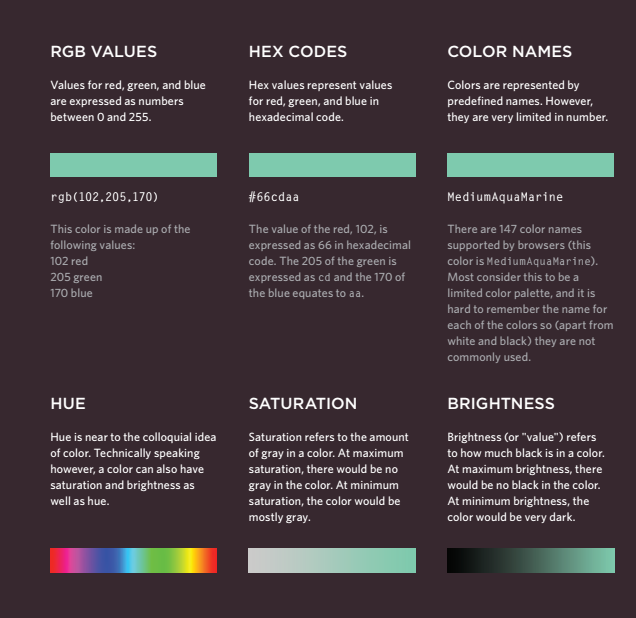

## Contrast

- When picking foreground and background
colors, it is important to ensure that there is
enough contrast for the text to be legible.

1. low Contrast
2. high Contrast
3. medium Contrast

## CSS3 :  OPACITY

- CSS3 introduces the opacity
property which allows you to
specify the opacity of an element
and any of its child elements.

- The value is a number between
0.0 and 1.0 (so a value of 0.5
is 50% opacity and 0.15 is 15%
opacity).

- The CSS3 rgba property allows
you to specify a color, just like
you would with an RGB value,
but adds a fourth value to
indicate opacity. This value is
known as an alpha value and is
a number between 0.0 and 1.0
(so a value of 0.5 is 50% opacity
and 0.15 is 15% opacity).

- The rgba value will only affect the
element on which it is applied (not child elements) .

## Css3: hsl Colors

- CSS3 introduces an entirely new and intuitive
way to specify colors using hue, saturation,
and lightness values.

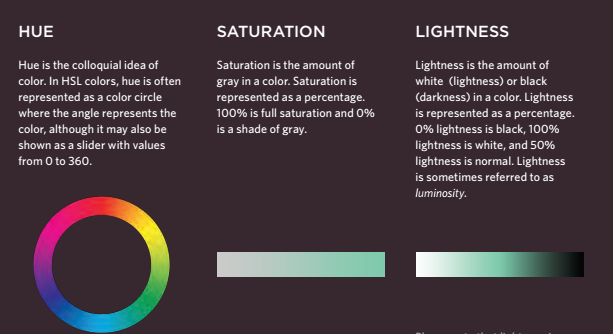

## CSS3 : hsl & hsla

- The hsl color property has
been introduced in CSS3 as an
alternative way to specify colors.
The value of the property starts
with the letters hsl, followed
by individual values inside
parentheses for:

1. hue
This is expressed as an angle
(between 0 and 360 degrees).
2. saturation
This is expressed as a
percentage.
3. lightness
This is expressed as a
percentage with 0% being white,
50% being normal, and 100%
being black.

- The hsla color property allows
you to specify color properties
using hue, saturation, and
lightness as above, and adds a
fourth value which represents
transparency (just like the rgba
property). The a stands for:

- alpha
This is expressed as a
number between 0 and 1.0.
For example, 0.5 represents
50% transparency, and 0.75
represents 75% transparency

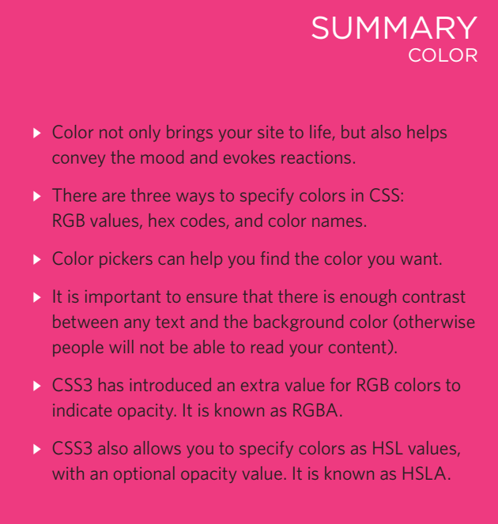

# TexT

## Typeface Terminology

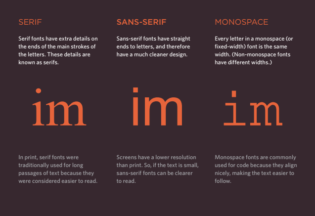

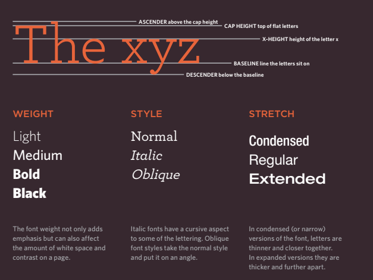

## chooSing a Typeface for your WebSiTe

- When choosing
a typeface, it
is important to
understand that a
browser will usually
only display it if it's
installed on that
user's computer.

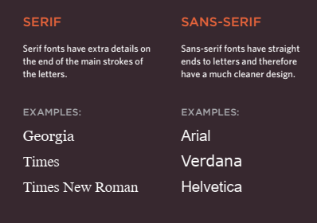

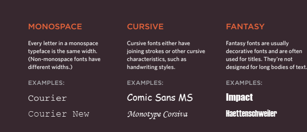

## TechniqueS ThaT offer a Wider choice of TypefaceS

- There are several ways to use fonts other than those listed on the
previous page. However, typefaces are subject to copyright, so the
techniques you can choose from are limited by their respective licenses.

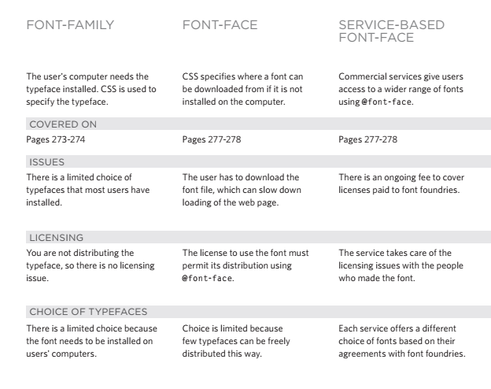

## Specifying TypefaceS : font-family

- The font-family property
allows you to specify the
typeface that should be used for
any text inside the element(s) to
which a CSS rule applies.
The value of this property is the
name of the typeface you want
to use.

## Size of Type: font-size

- The font-size property enables
you to specify a size for the
font. There are several ways to
specify the size of a font. The
most common are:

1. pixelS
Pixels are commonly used
because they allow web
designers very precise control
over how much space their text
takes up. The number of pixels is
followed by the letters px.
2. percenTageS
The default size of text in
browsers is 16px. So a size of
75% would be the equivalent of
12px, and 200% would be 32px.
If you create a rule to make all
text inside the body element
to be 75% of the default size (to
make it 12px), and then specify
another rule that indicates the
content of an element inside the
body element should be 75%
size, it will be 9px (75% of the
12px font size).
3. emS
An em is equivalent to the width
of a letter m.

## Type ScaleS

- You may have noticed that programs such as
Word, Photoshop and InDesign offer the same
sizes of text.

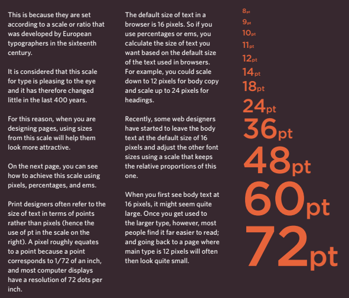

## uniTS of Type Size

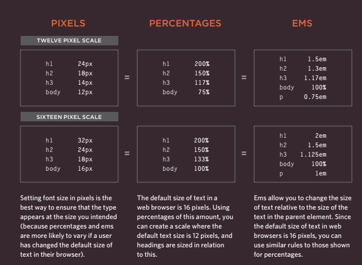

## more fonT choice : @font-face

- @font-face allows you to use
a font, even if it is not installed
on the computer of the person
browsing, by allowing you to
specify a path to a copy of the
font, which will be downloaded if
it is not on the user's machine.

- Because this technique allows
a version of the font to be
downloaded to the user's
computer, it is important that the
license for the font permits it to
be used in this way.

- You add the font to your style
sheet using the @font-face
rule, as shown on the right.

1. font-family
This specifies the name of the
font. This name can then be used
as a value of the font-family
property in the rest of the style
sheet (as shown in the rule for
the h1 and h2 elements).
2. src
This specifies the path to the
font. In order for this technique
to work in all browsers, you will
probably need to specify paths
to a few different versions of the
font, as shown on the next page.
3. format
This specifies the format that the
font is supplied in. (It's discussed
in detail on the next page.)

## underSTanding fonT formaTS

- Different browsers support
different formats for fonts
(in the same way that they
support different audio and
video formats), so you will need
to supply the font in several
variations to reach all browsers.

## bold : font-weight

- The font-weight property
allows you to create bold text.
There are two values that this
property commonly takes:

1. normal
This causes text to appear at a
normal weight.
2. bold
This causes text to appear bold

## iTicle :font-style

- If you want to create italic text,
you can use the font-style
property. There are three values
this property can take:

1. normal
This causes text to appear in a
normal style (as opposed to italic
or oblique).
2. italic
This causes text to appear italic.
3. oblique
This causes text to appear
oblique.

## uppercaSe & loWercaSe : text-transform

- The text-transform property
is used to change the case of
text giving it one of the following
values:

1. uppercase
This causes the text to appear
uppercase.
2. lowercase
This causes the text to appear
lowercase.
3. capitalize
This causes the first letter of
each word to appear capitalized

## underline & STrike : text-decoration

- The text-decoration property
allows you to specify the
following values:

1. none
This removes any decoration
already applied to the text.
2. underline
This adds a line underneath the
text.
3. overline
This adds a line over the top of
the text.
4. line-through
This adds a line through words.
5. blink
This animates the text to make it
flash on and off

## leading : line-height

- Leading (pronounced ledding) is
a term typographers use for the
vertical space between lines of
text. In a typeface, the part of
a letter that drops beneath the
baseline is called a descender,
while the highest point of a letter
is called the ascender.

## leTTer & Word Spacing : letter-spacing, word-spacing

- Kerning is the term
typographers use for the space
between each letter. You can
control the space between each
letter with the letter-spacing
property.
- It is particularly helpful to
increase the kerning when
your heading or sentence is
all in uppercase. If your text is
in sentence (or normal) case,
increasing or decreasing the
kerning can make it harder to
read.
- You can also control the gap
between words using the
word-spacing property.

## alignmenT : text-align

- The text-align property allows
you to control the alignment of
text. The property can take one
of four values:

1. left
This indicates that the text
should be left-aligned.
2. right
This indicates that the text
should be right-aligned.
3. center
This allows you to center text.
4. justify
This indicates that every line in
a paragraph, except the last line,
should be set to take up the full
width of the containing box

## verTical alignmenT : vertical-align

- The vertical-align property is
a common source of confusion.
It is not intended to allow you to
vertically align text in the middle
of block level elements such as
p and div, although it does
have this effect when used with
table cells (the td and th
elements).
- The values it can take are:
 (baseline
sub
super
top
text-top
middle
bottom
text-bottom)

## indenTing TexT : text-indent

- The text-indent property
allows you to indent the first
line of text within an element.
The amount you want the line
indented by can be specified in
a number of ways but is usually
given in pixels or ems

## CSS3  :drop shadow  : text-shadow

- The text-shadow property has
become commonly used despite
lacking support in all browsers.
It is used to create a drop
shadow, which is a dark version
of the word just behind it and
slightly offset.
- It can also be used
to create an embossed effect by
adding a shadow that is slightly
lighter than the text

## firST leTTer or line :first-letter, :first-line

- You can specify different values
for the first letter or first line of
text inside an element using
:first-letter and
:first-line.
- Technically these are not
properties. They are known as
pseudo-elements.
- You specify the pseudo-element
at the end of the selector, and
then specify the declarations as
you would normally for any other
element.

## STyling linkS :link, :visited

- In CSS, there are two pseudoclasses that allow you to set
different styles for links that
have and have not yet been
visited.

1. :link
This allows you to set styles
for links that have not yet been
visited.
2. :visited
This allows you to set styles for
links that have been clicked on.

- They are commonly used to
control colors of the links and
also whether they are to appear
underlined or not.

## reSponding To uSerS :hover, :active, :focus

- There are three pseudo-classes
that allow you to change the
appearance of elements when a
user is interacting with them.

1. :hover
This is applied when a user
hovers over an element with a
pointing device such as a mouse.
This has commonly been used
to change the appearance of
links and buttons when a user
places their cursor over them. It
is worth noting that such events
do not work on devices that use
touch screens (such as the iPad)
because the screen is not able to
tell when someone is hovering
their finger over an element.
2. :active
This is applied when an element
is being activated by a user; for
example, when a button is being
pressed or a link being clicked.
Sometimes this is used to make
a button or link feel more like it
is being pressed by changing the
style or position of the element
slightly.
3. :focus
This is applied when an element
has focus. Any element that
you can interact with, such as a
link you can click on or any form
control can have focus

## aTTribuTe SelecTorS

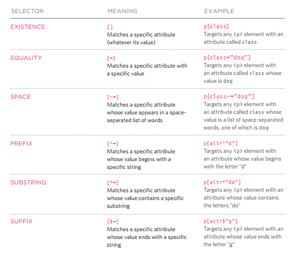

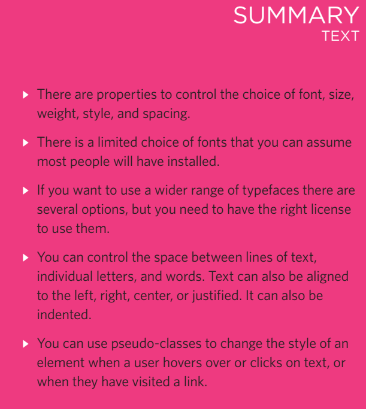

# JPEG vs PNG vs GIF

- Use JPEG format for all images that contain a natural scene or photograph where variation in colour and intensity is smooth. Use PNG format for any image that needs transparency or for images with text & objects with sharp contrast edges like logos. Use GIF format for images that contain animations.

- PNG is a lossless image format using DEFLATE compression. No data is lost during compression and no compression artefacts are introduced in the image. For this reason, a PNG image would retain higher quality than an image than JPEG and would look a lot sharper, it would also occupy more space on the disk. This makes it unsuitable for storing or transferring high-resolution digital photographs but a great choice for images with text, logos and shapes with sharp edges.

- GIF is also a lossless image format that uses LZW compression algorithm. It was favoured over PNG for simple graphics in websites in its early days because the support of PNG was still growing. Given that PNG is now supported across all major devices and that PNG compression is about 5–25% better than GIF compression, GIF images are now mainly used only if the image contains animations.

- JPEG images don’t support transparency and are hence not usable for such cases.

- PNG images support transparency in two ways — inserting an alpha channel that allows partial transparency or by declaring a single colour as transparent (index transparency)

- GIF images support transparency by declaring a single colour in the colour palette as transparent (index transparency)