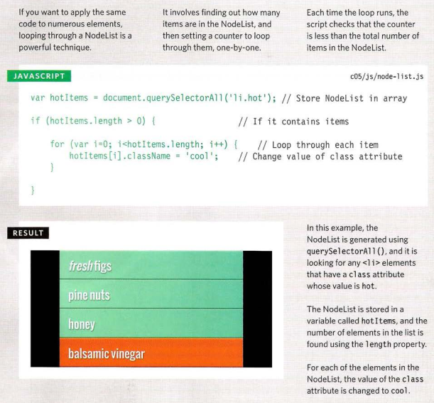

# Understanding The Problem Domain Is The Hardest Part Of Programming

- There are many common answers to this question:

1. Learning a new technology
2. Naming things
3. Testing your code
4. Debugging
5. Fixing bugs
6. Making software maintainable

- The reason why puzzles like this one are so hard, is because you can’t really see what you are trying to build very clearly.  Normally when you put together a jigsaw puzzle you follow steps that might look something like this:

1. Figure out what the major components of the picture are
2. Sort the pieces by color or component
3. Put together all the border pieces
4. Put together each component of the picture from the piles you created

- if understanding the problem domain is the hardest part of programming and you want to make programming easier, you can do one of two things:

1. Make the problem domain easier
2. Get better at understanding the problem domain

# WHAT IS AN OBJECT?

- Objects group together a set of variables and functions to create a model
of a something you would recognize from the real world. In an object,
variables and functions take on new names

- IN AN OBJECT: VARIABLES BECOME
KNOWN AS PROPERTIES :

      If a variable is part of an object, it is called a property 

- IN AN OBJECT: FUNCTIONS BECOME
KNOWN AS METHODS :

      If a function is part of an object, it is called a method

- This object represents a hotel. It has five properties and one method.
The object is in curly braces. It is stored in a variable called hotel .

## creating an object : literal notation

## Accessing an object and dor notation

## CREATING·OBJECTS USING LITERAL NOTATION

## CREATING MORE OBJECT LITERALS

# Document Object Model

- The Document Object Model (DOM) specifies
how browsers should create a model of an HTML
page and how JavaScript can access and update the
contents of a web page while it is in the browser window.

- The DOM is neither part of HTML, nor part of JavaScript; it is a separate set of rules.
It is implemented by all major browser makers, and covers two primary areas:

- MAKING A MODEL OF THE
HTML PAGE :
- When the browser loads a web page, it
creates a model of the page in memory.
- The DOM specifies the way in which the
browser should structure this model using
a DOM tree.
- The DOM is called an object model
because the model (the DOM tree) is
made of objects.
- Each object represents a different part of
the page loaded in the browser window.

- ACCESSING AND CHANG ING
THE HTML PAGE
The DOM also defines methods and
properties to access and update each
object in this model, which in turn updates
what the user sees in the browser.
- You will hear people call the DOM an
Application Programming Interface (API).

## THE DOM TREE IS A MODEL OF A WEB PAGE

- As a browser loads a web page, it creates a model of that page.
The model is called a DOM tree, and it is stored in the browsers' memory.
It consists of four main types of nodes.

- Each node is an object with methods and properties.
Scripts access and update this DOM tree (not the source HTML file).
Any changes made to the DOM tree are reflected in the browser.

## WORKING WITH THE DOM TREE 

- Accessing and updating the DOM tree involves two steps:

1. Locate the node that represents the element you want to work with.
2. Use its text content, child elements, and attributes.

- The terms elements and element nodes are used interchangeably
but when people say the DOM is working with an element,
it is actually working with a node that represents that element.

## CACHING DOM QUERIES 

## ACCESSING ELEMENTS

- DOM queries may return one element, or they may return a Nodelist,
which is a collection of nodes.

- METHODS THAT RETURN A SINGLE ELEMENT NODE:

1. getElementByld( ' id ' )
2. querySel ector( 'css selector ')
3. getEl ementsByClassName( 'class ' )
4. getEl ementsByTagName( ' tagName ' )
5. querySelectorAll ( 'css selector ')

## METHODS THAT SELECT INDIVIDUAL ELEMENT 

## SELECTING ELEMENTS USING ID ATTRIBUTES

- get Element By id() allows you
to select a single element node
by specifying the value of its
id attribute.

## NODELISTS: DOM QUERIES THAT RETURN MORE THAN ONE ELEMENT

- When a DOM method can return more than one element, it returns a
Nodelist (even if it only finds one matching element).

- A Nodelist is a collection of element nodes. Each
node is given an index number (a number that starts
at zero, just like an array)

- The order in which the element nodes are stored in a
NodeList is the same order that they appeared in the
HTML page.
- When a DOM query returns a Nodelist, you may
want to:

1. Select one element from the NodeList.
2. Loop through each item in the Nodelist and
perform the same statements on each of the
element nodes.

### LIVE & STATIC NODELISTS

- In a static Nodelist when your script updates the
page, the NodeList is not updated to reflect the
changes made by the script.

- In a live Nodelist, when your script updates the
page, the Nodelist is updated at the same time.
The methods beginning getEl ementsBy_ return live
Nodelists. They are also typically faster to generate
than static Nodelists.

## SELECTING AN ELEMENT FROM A NODELIST

- There are two ways to select an element from a Nodelist:
The item() method and array syntax.
Both require the index number of the element you want.

## SELECTI NG ELEMENTS USING CLASS ATTRIBUTES

## SELECTING ELEMENTS BY TAG NAME

## SELECTING ELEMENTS USING CSS SELECTORS

## repeating actions for an entire nodelist

## LOOPING THROUGH A NODELIST

## LOOPING THROUGH A NODELIST : paly-by-play

## TRAVERSING THE DOM

- When you have an element node, you can select
another element in relation to it using these five
properties. This is known as traversing the DOM.

1. parentNode : This property finds the element
node for the containing (or
parent) element in the HTML
2. previousSibling
nextSibling : These properties find the
previous or next sibling of a node
if there are siblings.
3. first Chil d
 and lastChild : These properties find the first or
last child of the current element

## WHITESPACE NODES

- Traversing the DOM can be difficult because
some browsers add a text node whenever they
come across whitespace between elements.

## PREVIOUS & NEXT SIBLING

## FlRST & LAST CHILD

## HOW TO GET/UPDATE ELEMENT CONTENT

- So far this chapter has focused on finding elements in the DOM tree.
The rest of this chapter shows how to access/update element content.
Your choice of techniques depends upon what the element contains

## ACCESS & UPDATE A TEXT NODE WITH NODEVALUE

- When you select a text node, you can retrieve or amend the content of it
using the nodeVa1ue property

## ACCESSING & CHANGI NG A TEXT NODE

## ACCESS & UPDATE TEXT WITH TEXTCONTENT (& INN ERTEXT)

- The textContent property allows you to
collect or update just the text that is in the
containing element (and its children).

- textContent :To collect the text from the
li  elements in our example
(and ignore any markup inside
the element) you can use the
textContent property on the
containing l i  element. In this
case it would return the value:
fresh figs.

- innerText :
li - attribute
document .getElementByid('one') .textContent;
One issue with the textContent property is that Internet Explorer did
not support it until IE9. (All other major browsers support it.)
You may also come across a property called i nner Text, but you should generally avoid it for three key reasons:

1. SUPPORT :
Although most browser
manufacturers adopted the
property, Firefox does not
because i nnerText is not part of
any standard.
2. OBEYS CSS :
It will not show any content
that has been hidden by CSS.
For example, if there were a CSS
rule that hid the em elements,
the i nnerText property would
return only the word figs.
3. PERFORMANCE :
Because the i nnerText property
takes into account layout rules
that specify whether the element
is visible or not, it can be slower
to retrieve the content than the
textContent property.

## ACCESSING TEXT ONLY

## ADDING OR REMOVING HTML CONTACT

## ACCESS & UPDATE TEXT & MARKUP WITH INNERHTML

- Using the i nnerHTML property, you can access
and amend the contents of an element,
including any child elements.

1. innerHTML
When getting HTML from an
element, the i nnerHTML property
will get the content of an
element and return it as one long
string, including any markup that
the element contains.
2. GET CONTENT
The following line of code collects the content of the list item and adds it
to a variable called elcontent
3. SET CONTENT
The following line of code adds the content of the e1Content variable
(including any markup) to the first list item

## UPDATE TEXT & MARKUP

## ADDING ELEMENTS USING DOM MANIPULATION

- DOM manipulation offers another technique
to add new content to a page (rather than
i nnerHTML). It involves three steps:

1. CREATE THE ELEMENT
2. GIVE IT CONTENT
3. ADD IT TO THE DOM

## ADDING AN ELEMENT TO THE DOM TREE

## REMOVING ELEMENTS VIA DOM MANIPULATION

- DOM manipulation can be used to remove
elements from the DOM tree.

1. STORE THE ELEMENT
TO BE REMOVED IN A
VARIABLE
2. STORE THE PARENT OF
THAT ELEMENT IN A
VARIABLE
3. REMOVE THE ELEMENT
FROM ITS CONTA INING
ELEMENT

## REMOVING AN ELEMENT FROM THE DOM TREE

## COMPARING TECHNIQUES: UPDATING HTML CONTENT

- So far, you have seen three techniques for adding HTML to a web page.
It's time to compare when you should use each one
- document.write()
The document object's write() method is a simple
way to add content that was not in the original
source code to the page, but its use is rarely advised.
- ADVANTAGES

1. It is a quick and easy way to show beginners how
content can be added to a page.

- DISADVANTAGES
• It only works when the page initially loads.
• If you use it after the page has loaded it can:

1. Overwrite the whole page
2. Not add the content to the page
3. Create a new page
• It can cause problems with XHTML pages that
are strictly validated.
• This method is very rarely used by programmers
these days and is generally frowned upon

## CROSS-SITE SCRIPTING (XSS) ATTACKS

- If you add HTML to a page using i nnerHTML (or several jQuery methods),
you need to be aware of Cross-Site Scripting Attacks or XSS; otherwise,
an attacker could gain access to your users' accounts.

## DEFENDING AGAINST CROSS-SITE SCRIPTING

## XSS: VALIDATION & TEMPLATES

- Make sure that your users can only input characters they need to use
and limit where this content will be shown on the page.

- FILTER OR VALIDATE INPUT
The most basic defense is to prevent users from
entering characters into form fields that they do not
need to use when providing that kind of information.
- LIMIT WHERE USER CONTENT GOES
Malicious users will not just use script tags to
try and create an XSS attack

## XSS: ESCAPING & CONTROLLING MARKUP

- Any content generated by users that contain characters that are used
in code should be escaped on the server. You must control any markup
added to the page.
- ESCAPING USER CONTENT
All data from untrusted sources should be escaped
on the server before it is shown on the page.
- ADDING USER CONTENT
When you add untrusted content to an HTML page,
once it has been escaped on the server, it should still
be added to the page as text.

## ATTRIBUTE NODES

## CHECK FOR AN ATTRIBUTE AND GET ITS VALUES

## CREATING ATTRIBUTES & CHANGING THEIR VALUES

## REMOVING ATTRIBUTES

