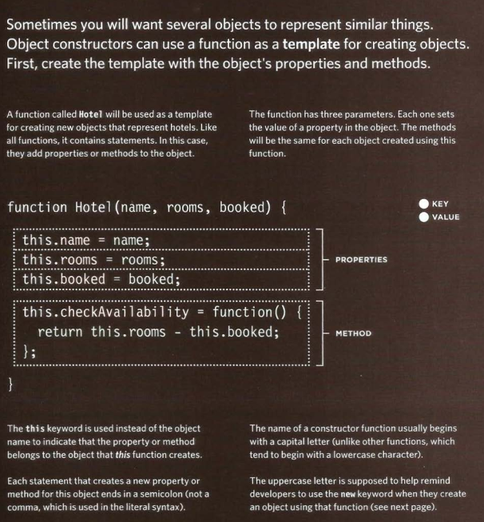
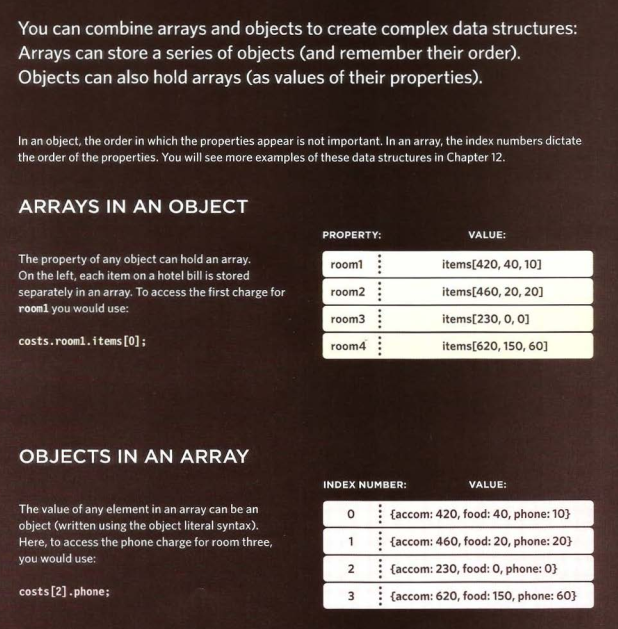
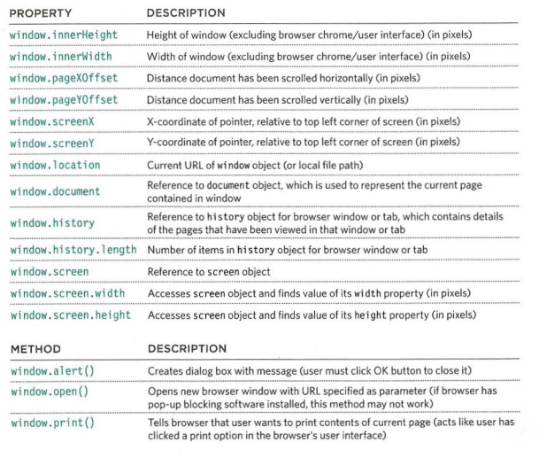

# Domain Modeling

- Domain modeling is the process of creating a conceptual model in code for a specific problem. A model describes the various entities, their attributes and behaviors, as well as the constraints that govern the problem domain. An entity that stores data in properties and encapsulates behaviors in methods is commonly referred to as an object-oriented model.

- A domain model that's articulated well can verify and validate the understanding of a specific problem among various stakeholders. As a communication tool, it defines a vocabulary that can be used within and between both technical and business teams.

## Model epic fails videos

- imagine you've been tasked to build a program that models the popularity of epic fail videos. After months of painstaking research, you've determined that the two essential metrics for gauging popularity are an epic rating and whether or not the video has animals.

- Since you'll be modeling the popularity of many types of videos—parkour epic fails, corgi epic fails, etc.—you'll want to build self-contained objects with the same attributes and behaviors. That way, when you need to change the algorithm for determining popularity, the changes will be small and targeted.

# Tables

## WhaT's a Table?

- A table represents information in a grid format.
Examples of tables include financial reports, TV
schedules, and sports results.

## basic Table structure

## Table headings

-The th element is used just
like the td element but its
purpose is to represent the
heading for either a column or
a row. (The th stands for table
heading.)

## spanning columns

- The colspan attribute can be
used on a th or td element
and indicates how many columns
that cell should run across.

## spanning roWs

- The rowspan attribute can be
used on a th or td element
to indicate how many rows a cell
should span down the table.

## long Tables

- There are three elements that
help distinguish between the
main content of the table and
the first and last rows (which can
contain different content).

1. thead
The headings of the table should
sit inside the thead element.
2. tbody
The body should sit inside the
tbody element.
3. tfoot
The footer belongs inside the
tfoot element.

## old code: WidTh & spacing

- There are some outdated
attributes which you should not
use on new websites. You may,
however, come across some
of them when looking at older
code, so I will mention them
here. All of these attributes have
been replaced by the use of CSS.

- The width attribute was used
on the opening table tag to
indicate how wide that table
should be and on some opening
th and td tags to specify
the width of individual cells.
The value of this attribute is
the width of the table or cell in
pixels.

## old code: border & background

- The border attribute was used
on both the table and td
elements to indicate the width of
the border in pixels.
- The bgcolor attribute was used
to indicate background colors
of either the entire table or
individual table cells. The value
is usually a hex code.

# Functions, Methods, and Objects

## creating an object : constructor notation

## update an object 

## creating many objects : constructor notation

## CREATING OBJECTS USING CONSTRUCTOR SYNTAX

## CREATE & ACCESS OBJECTS CONSTRUCTOR NOTATION

- To get a better idea of why you
might want to create multiple
objects on the same page, here
is an example that shows room
availability in two hotels.
- First, a constructor function
defines a template for the hotels.
Next, two different instances
of this type of hotel object are
created. The first represents
a hotel called Quay and the
second a hotel called Park.
- Having created instances of
these objects, you can then
access their properties and
methods using the same dot
notation that you use with all
other objects.

## ADDING AND REMOVING PROPERTIES

- Once you have created an object
(using literal or constructor
notation), you can add new
properties to it.
- You do this using the dot
notation that you saw for adding
properties to objects

## RECAP: WAYS TO CREATE OBJECTS

## THIS (IT IS A KEYWORD)

- The keyword this is commonly used inside functions and objects.
Where the function is declared alters what this means. It always refers
to one object, usually the object in which the function operates.

1. A FUNCTION IN GLOBAL SCOPE
When a function is created at the top level of a script
(that is, not inside another object or function), then it
is in the global scope or global context
2. GLOBAL VARIABLES
All global variables also become properties of the
window object. so when a function is in the global
context, you can access global variables using the
window object, as well as its other properties.
3. A METHOD OF AN OBJECT
When a function is defined inside an object, it
becomes a method. In a method, this refers to the
containing object.
4. FUNCTION EXPRESSION AS METHOD
If a named function has been defined in global
scope, and it is then used as a method of an object,
this refers to the object it is contained within.

## RECAP: STORING DATA

- In JavaScript, data is represented using name/value pairs.
To organize your data, you can use an array or object to group a set of
related values. In arrays and objects the name is also known as a key.

- VARIABLES
A variable has just one key (the variable name)
and one value.

- ARRAYS
Arrays can store multiple pieces of information.
Each piece of information is separated by a comma.
The order of the values is important because items
in an array are assigned a number (called an index)

- If you want to access items via a property name or key, use an object

- INDIVIDUAL OBJECTS
Objects store sets of name/value pairs. They can be
properties (variables) or methods (functions)

- MULTIPLE OBJECTS
When you need to create multiple objects within the
same page, you should use an object constructor to
provide a template for the objects.

## array are object 

## array of objects & object in array

## WHAT ARE BUILT-IN OBJECTS?

- Browsers come with a set of built-in objects that represent things like the
browser window and the current web page shown in that window. These
built-in objects act like a toolkit for creating interactive web pages.

## three groups of built-in objects

## THE BROWSER OBJECT MODEL: THE WINDOW OBJECT

- The window object represents the current
browser window or tab. It is the topmost object
in the Browser Object Model, and it contains
other objects that tell you about the browser.

## USING THE BROWSER OBJECT MODEL

## THE DOCUMENT OBJECT MODEL:THE DOCUMENT OBJECT

- The topmost object in the Document Object Model (or DOM) is the
document object. It represents the web page loaded into the current
browser window or tab.

## USING THE DOCUMENT OBJECT

## GLOBAL OBJECTS:STRING OBJECT

- Whenever you have a value that is a string, you can use the properties
and methods of the String object on that value.

## WORKING WITH STRINGS

1. This example starts by storing
the phrase "Home sweet home "
in a variable called saying.
JAVASCRIPT
2. The next line tells you how
many characters are in the string
using the 1ength property of the
String object and stores the
result in a variable called msg.
3. This is followed by examples
showing several of the Stri ng
object's methods

## DATA TYPES REVISITED

- In JavaScript there are six data types:
Five of them are described as simple (or primitive) data types.
The sixth is the object (and is referred to as a complex data type)

- JavaScript has five simple (or primitive) data types:

1. String
2. Number
3. Boolean
4. Undefined (a variable that has been declared, but
no value has been assigned to it yet)
5. Null (a variable with no value - it may have had
one at some point, but no longer has a value)
6.0bject
Under the hood, arrays and functions are considered
types of objects.

## GLOBAL OBJECTS: NUMBER OBJECT

- Whenever you have a value that is a number,
you can use the methods and properties of the
Number object on it.

## WORKING WITH DECIMAL NUMBERS

1. In this example, a number
is stored in a variable called
ori ginalNumber, and it isthen
rounded up or down using two
different techniques
.originalNumber.toFixed(3)
will round the number stored
in the variable ori gi nal Number
to three decimal places.
3.toPrecision(3) uses the
number in parentheses to
indicate the total number of
digits the number should have.

## GLOBAL OBJECTS: MATH OBJECT

- The Math object has properties and methods
for mathematical constants and functions.

## MATH OBJECT TO CREATE RANDOM NUMBERS

## creating an instace of the date object

## GLOBAL OBJECTS:DATE OBJECT (AND TIME)

## CREATING A DATE OBJECT

## WORKING WITH DATES & TIMES

