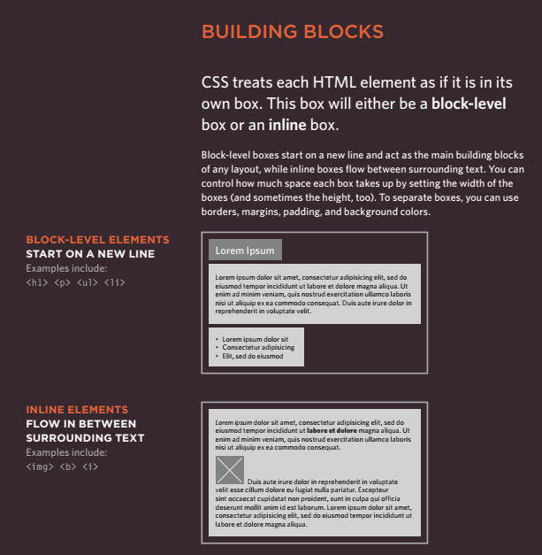
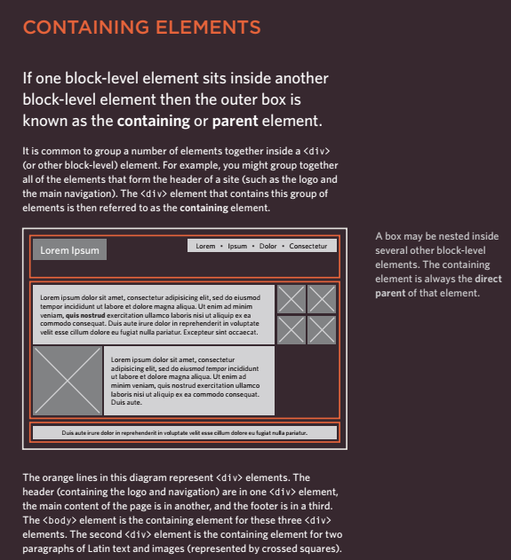
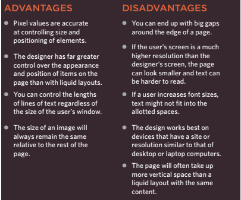
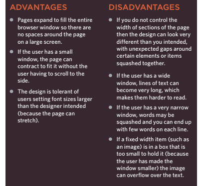
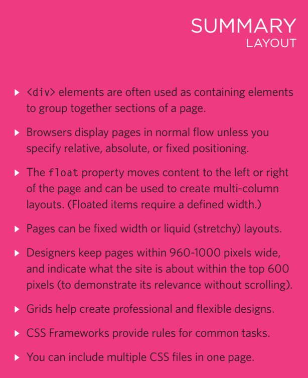

# Layout

## Key ConCepts in positioning eLements

## ControLLing the position of eLements

- CSS has the following positioning schemes that allow you to control
the layout of a page: normal flow, relative positioning, and absolute
positioning. You specify the positioning scheme using the position
property in CSS. You can also float elements using the float property.

1. normal flow
2. relative Positioning
3. aBsolute Positioning

- To indicate where a box should be positioned, you may also need to use
box offset properties to tell the browser how far from the top or bottom
and left or right it should be placed.

- fixed Positioning
This is a form of absolute
positioning that positions
the element in relation to the
browser window.
- floating elements
Floating an element allows
you to take that element out
of normal flow and position
it to the far left or right of a
containing box.

## normaL flow position:static

- In normal flow, each block-level
element sits on top of the next
one. Since this is the default
way in which browsers treat
HTML elements, you do not
need a CSS property to indicate
that elements should appear
in normal flow, but the syntax
would be:
position: static;

## reLative positioning position:relative

- Relative positioning moves an
element in relation to where it
would have been in normal flow.

## absoLute positioning position:absolute

- When the position property
is given a value of absolute,
the box is taken out of normal
flow and no longer affects the
position of other elements on
the page

## fixed positioning

- Fixed positioning is a type
of absolute positioning that
requires the position property
to have a value of fixed.

## overLapping eLements z-index

- When you use relative, fixed, or
absolute positioning, boxes can
overlap. If boxes do overlap, the
elements that appear later in the
HTML code sit on top of those
that are earlier in the page.

## fLoating eLements : float

- The float property allows you
to take an element in normal
flow and place it as far to the
left or right of the containing
element as possible

## using float to pLace eLements side-by-side

- A lot of layouts place boxes
next to each other. The float
property is commonly used to
achieve this.
- When elements are floated, the
height of the boxes can affect
where the following elements sit.

## CLearing floats : clear

- The clear property allows you
to say that no element (within
the same containing element)
should touch the left or righthand sides of a box. It can take
the following values:.

1. right
2. left
3. both
4. none

## parents of fLoated eLements: probLem

- If a containing element only
contains floated elements, some
browsers will treat it as if it is
zero pixels tall.

## parents of fLoated eLements: soLution

- Traditionally, developers got
around this problem by adding
an extra element after the
last floated box (inside the
containing element).

## creating muLti-CoLumn Layouts with fLoats

- Many web pages use multiple
columns in their design. This
is achieved by using a div
element to represent each
column. The following three CSS
properties are used to position
the columns next to each other:

1. width
2. float
3. margin

## screen size

- Different visitors to your site will have different sized screens that show
different amounts of information, so your design needs to be able to
work on a range of different sized screens.

## sCreen resoLution

- Resolution refers to the number of dots a screen shows per inch. Some
devices have a higher resolution than desktop computers and most
operating systems allow users to adjust the resolution of their screens.

## page sizes

- Because screen sizes and display resolutions vary so much, web
designers often try to create pages of around 960-1000 pixels wide
(since most users will be able to see designs this wide on their screens).

## fixed width Layouts

- Fixed width layout
designs do not
change size as the
user increases
or decreases
the size of their
browser window.
Measurements tend
to be given in pixels.

## Liquid Layouts

- Liquid layout designs
stretch and contract
as the user increases
or decreases the
size of their browser
window. They tend to
use percentages

## A fixed width Layout

- To create a fixed width layout,
the width of the main boxes on
a page will usually be specified
in pixels (and sometimes their
height, too)

## The liquid layout uses

- percentages to specify the width
of each box so that the design
will stretch to fit the size of the
screen.

## Layout grids

- Composition in any visual art (such as design, painting, or photography)
is the placement or arrangement of visual elements — how they are
organized on a page. Many designers use a grid structure to help them
position items on a page, and the same is true for web designers.

## Css frameworKs

- SS frameworks aim to make your life easier by providing the code for
common tasks, such as creating layout grids, styling forms, creating
printer-friendly versions of pages and so on. You can include the CSS
framework code in your projects rather than writing the CSS from scratch.
Css frameworKs
- advantages

1. They save you from
repeatedly writing code for
the same tasks.
2. They will have been tested
across different browser
versions (which helps avoid
browser bugs).

- disadvantages

1. They often require that you
use class names in your
HTML code that only control
the presentation of the page
(rather than describe its
content).
2. In order to satisfy a wide
variety of needs, they often
contain more code than you
need for your particular web
page (commonly referred to
as code “bloat”).

## a grib-based Layout using 960.gs

- Let's take a look at an HTML
page and how it has been
marked up to use the 960.gs grid
system.
- You can see that we include
the CSS for the grid using the
link element inside the
head of the page

## muLtipLe styLe sheets @import

- Some web page authors split
up their CSS style rules into
separate style sheets. For
example, they might use one
style sheet to control the layout
and another to control fonts,
colors and so on.
- Some authors take an even
more modular approach
to stylesheets, creating
separate stylesheets to control
typography, layout, forms,
tables, even different styles for
each sub-section of a site.
- There are two ways to add
multiple style sheets to a page:

1. Your HTML page can link
to one style sheet and that
stylesheet can use the @import
rule to import other style sheets.
2. In the HTML you can use a
separate link element for
each style sheet.

## muLtipLe styLe sheets link

- On this page you can see the
other technique for including
multiple style sheets. Inside the
head element is a separate
link element for each style
sheet.

mmmm
