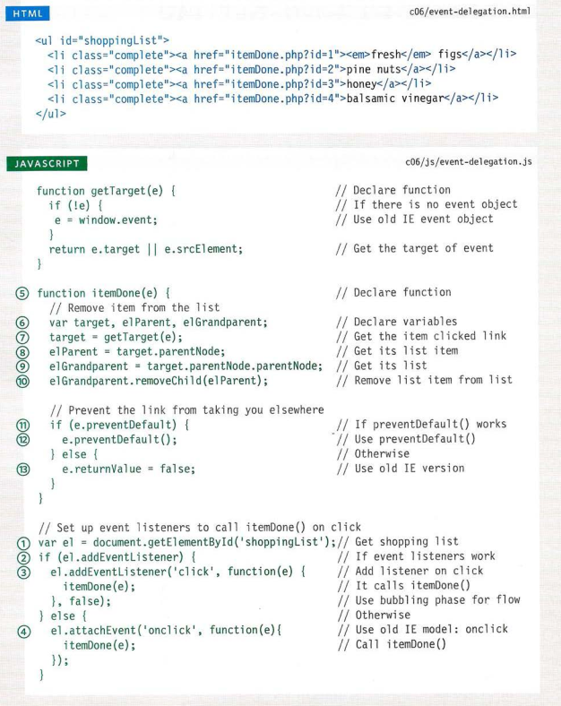

# Forms

## Why Forms?

- The best known form on the web is probably
the search box that sits right in the middle of
Google's homepage.

## Form Controls

- There are several types of form controls that
you can use to collect information from visitors
to your site.

1. ADDInG tEXt:
2. mAkInG ChoICEs:
3. submIttInG Forms:
4. uploADInG FIlEs

## hoW Forms Work

- A user fills in a form and then presses a button
to submit the information to the server.
- A form may have several form controls, each
gathering different information. The server
needs to know which piece of inputted data
corresponds with which form element.

## Form struCturE

## text input

## pAssWorD Input

## text area

- The textarea element
is used to create a mutli-line
text input. Unlike other input
elements this is not an empty
element. It should therefore have
an opening and a closing tag.

## rADIo button

- input
type="radio"
Radio buttons allow users to pick
just one of a number of options.
name
- The name attribute is sent to
the server with the value of the
option the user selects. When
a question provides users with
options for answers in the form
of radio buttons, the value of
the name attribute should be the
same for all of the radio buttons
used to answer that question.
- value
The value attribute indicates
the value that is sent to the
server for the selected option.
The value of each of the buttons
in a group should be different
(so that the server knows which
option the user has selected).
- checked
The checked attribute can be
used to indicate which value (if
any) should be selected when
the page loads. The value of this
attribute is checked. Only one
radio button in a group should
use this attribute.

## checkbox

- type="checkbox"
Checkboxes allow users to select
(and unselect) one or more
options in answer to a question.

## Drop DoWn lIst boX

- select
A drop down list box (also
known as a select box) allows
users to select one option from a
drop down list.
- The select element is used
to create a drop down list box. It
contains two or more option
elements.
- name
The name attribute indicates the
name of the form control being
sent to the server, along with the
value the user selected.
option.
-The option element is used
to specify the options that the
user can select from. The words
between the opening option
and closing option tags will
be shown to the user in the drop
down box.

## multIplE sElECt boX

- select :
- size
You can turn a drop down select
box into a box that shows more
than one option by adding the
size attribute.

- multiple
You can allow users to select
multiple options from this list by
adding the multiple attribute
with a value of multiple

## FIlE Input boX

- input
If you want to allow users to
upload a file (for example an
image, video, mp3, or a PDF),
you will need to use a file input
box.
- type="file"
This type of input creates a
box that looks like a text input
followed by a browse button.

## submIt button

- type="submit"
The submit button is used to
send a form to the server.
- name
It can use a name attribute but it
does not need to have one.
- value
The value attribute is used to
control the text that appears
on a button

## ImAGE button

- type="image"
If you want to use an image for
the submit button, you can give
the type attribute a value of
image. The src, width, height,
and alt attributes work just
like they do when used with the
img elemen.

## button & hIDDEn Controls

- The button element was
introduced to allow users more
control over how their buttons
appear, and to allow other
elements to appear inside the
button.

- type="hidden"
This example also shows a
hidden form control

## lAbEllInG Form Controls

- label
When introducing form controls,
the code was kept simple by
indicating the purpose of each
one in text next to it

- The label element can be
used in two ways. It can:

1. Wrap around both the text
description and the form input
(as shown on the first line of the
example to your right).
2. Be kept separate from the
form control and use the for
attribute to indicate which form
control it is a label for (as shown
with the radio buttons).

## GroupInG Form ElEmEnts

- fieldset
You can group related form
controls together inside the
fieldset element. This is
particularly helpful for longer
forms.

- legend
The legend element can
come directly after the opening
fieldset tag and contains a
caption which helps identify the
purpose of that group of form
controls.

## html5: Form VAlIDAtIon

- You have probably seen forms
on the web that give users
messages if the form control has
not been filled in correctly; this is
known as form validation.

## html5: DAtE Input

- input
Many forms need to gather
information such as dates, email
addresses, and URLs. This has
traditionally been done using
text inputs.

- type="date"

## html5: EmAIl & url Input

- input
HTML5 has also introduced
inputs that allow visitors to
enter email addresses and URLs.
Browsers that do not support
these input types will just treat
them as text boxes.
type="email"

## html5: sEArCh Input

- input
If you want to create a single
line text box for search queries,
HTML5 provides a special type
of input for that purpose.
type="search"

# Lists, tabLes and Forms

## bULLet Point styLes : list-style-type

- The list-style-type property
allows you to control the shape
or style of a bullet point (also
known as a marker).
It can be used on rules that
apply to the ol, ul, and li
elements.
Unordered List/ ordered Lists

## image For bullets : list-style-image

- You can specify an image to act
as a bullet point using the
list-style-image property

## Positioning the marker : list-style-position

- Lists are indented into the page
by default and the list-styleposition property indicates
whether the marker should
appear on the inside or the
outside of the box containing the
main points.
This property can take one of
two values:

1. outside
The marker sits to the left of the
block of text. (This is the default
behaviour if this property is not
used.)
2. inside
The marker sits inside the box of
text (which is indented)

## List shorthand list-style

- As with several of the other CSS
properties, there is a property
that acts as a shorthand for list
styles. It is called list-style,
and it allows you to express
the markers' style, image and
position properties in any order

## tabLe ProPerties

- You have already met several
properties that are commonly
used with tables

## border on emPty ceLLs : empty-cells

- If you have empty cells in
your table, then you can use
the empty-cells property to
specify whether or not their
borders should be shown.
- It can take one of three values:

1. show
This shows the borders of any
empty cells.
2. hide
This hides the borders of any
empty cells.
3. inherit
If you have one table nested
inside another, the inherit
value instructs the table cells to
obey the rules of the containing
table.

## gaPs between ceLLs border-spacing, border-collapse

- The border-spacing property
allows you to control the
distance between adjacent cells.
By default, browsers often leave
a small gap between each table
cell, so if you want to increase
or decrease this space then
the border-spacing property
allows you to control the gap.

- border-collapse property two Possible values are:

1. collapse
Borders are collapsed into a
single border where possible.
(border-spacing will be
ignored and cells pushed
together, and empty-cells
properties will be ignored.)
2. separate
Borders are detached from each
other. (border-spacing and
empty-cells will be obeyed.)

## styLing text inPUts

- font-size sets the size of the
text entered by the user.
color sets the text color, and
background-color sets the
- background color of the input.
border adds a border around
the edge of the input box, and
border-radius can be used
to create rounded corners (for
browsers that support this
property).
- The :focus pseudo-class is
used to change the background
color of the text input when it
is being used, and the :hover
psuedo-class applies the same
styles when the user hovers over
them.
- background-image adds a
background image to the box.
Because there is a different
image for each input, we are
using an attribute selector
looking for the value of the id
attribute on each input.

## styLing sUbmit bUttons

- color is used to change the
color of the text on the button.
- text-shadow can give a 3D
look to the text in browsers that
support this property.
- border-bottom has been used
to make the bottom border of
the button slightly thicker, which
gives it a more 3D feel.
- background-color can make
the submit button stand out
from other items around it

## styLing FieLdsets & Legends

- Fieldsets are particularly helpful
in determining the edges of a
form. In a long form they can
help group together related
information within it.
- The legend is used to indicate
what information is required in
the fieldset.
- Properties commonly used with
these two elements include:

1. width  is used to control
the width of the fieldset.
2. color is used to control the
color of text.
3. background-color is used to
change the color behind these
items.
4. border is used to control the
appearance of the border around
the fieldset and/or legend.
5. border-radius is used to
soften the edges of these
elements in browsers that
support this property.
6. padding can be used to add
space inside these elements.

## aLigning Form controLs: ProbLem

- Labels for form elements are
often different lengths, which
means that the form controls will
not appear in a straight line. This
is demonstrated in the example
on the right (without CSS applied
to the form controls).

## aLigning Form controLs: soLUtion

- Each row of the form has a title
telling users what they need to
enter. For the text inputs, the
title is in the label element.
For the radio buttons, the title is
in a span element. Both have
a class attribute with a value of
title.

## cUrsor styLes

- The cursor property allows
you to control the type of mouse
cursor that should be displayed
to users.
- Here are the most commonly
used values for this property:
auto
crosshair
default
pointer
move
text
wait
help
url("cursor.gif");

## web deveLoPer tooLbar

- This helpful extension for Firefox and Chrome
provides tools to show you the CSS styles that
apply to an element when you hover over it,
along with the structure of the HTML

# Events

- When you browse the web, your browser registers different
types of events. It's the browser's way of saying, "Hey, this
just happened." Your script can then respond to these events.

## DIFFERENT EVENT TYPES

- Here is a selection of the events that occur in the browser while you are
browsing the web. Any of these events can be used to trigger a function
in your JavaScript code.

## TERMINOLOGY

1. EVENTS FIRE OR ARE RAISED
When an event has occurred, it is often described as having fired or
been raised. In the diagram on the right, if the user is tapping on a link, a
cl ick event would fire in the browser.
2. EVENTS TRIGGER SCRIPTS
Events are said to t rigger a function or script. When the click event
fires on the element in this diagram, it could trigger a script that enlarges
the selected item.

## HOW EVENTS TRIGGER JAVASCRIPT CODE

- When the user interacts with the HTML on a web page, there are three
steps involved in getting it to trigger some JavaScript code.
Together these steps are known as event handling.

1. Select t he element
node(s) you want the
script to respond to.
2. Indicate which event on
the selected node(s) will
trigger the response.
3. State the code you want
to run when the event
occurs

## THREE WAYS TO BIND AN EVENT TO AN ELEMENT

1. HTML EVENT HANDLER
ATTRIBUTES (DO NOT USE)
2. TRADITIONAL DOM
EVENT HANDLERS
3. DOM LEVEL 2 EVENT
LISTENERS

### TRADITIONAL DOM EVENT HANDLERS

- All modern browsers understand this way of creating an event handler,
but you can only attach one function to each event handler.

### USING DOM EVENT HANDLERS

## EVENT LISTENERS

- Event listeners are a more recent approach to handling events.
They can deal with more than one function at a time
but they are not supported in older browsers.

## USING EVENT LISTENERS

## USING PARAMETERS WITHEVENT HANDLERS & LISTENERS

- Because you cannot have parentheses after the
function names in event handlers or listeners,
passing arguments requires a workaround.

## USING PARAMETERS WITH EVENT LISTENERS

## SUPPORTING OLDER VERSIONS OF IE

- IES-8 had a different event model and did not support
addEventLi stener() but you can provide fallback code
to make event listeners work with older versions of IE.

## FALLBACK FOR USING EVENT LISTENERS IN IE8

- The event handling code builds on the last example,
but it is a lot longer this time because it contains the
fal lback for Internet Explorer 5-8.

- After the checkUsername{) function, an if
statement checks whether addEventLi stener() is
supported or not; it returns true if the element node
supports this method, and fa1se if it does not.

## event flow

## why flow matters

## THE EVENT OBJECT

- When an event occurs, the event object tells
you information about the event, and the
element it happened up

## USING EVENT LISTENERS WITH THE EVENT OBJECT

## EVENT DELEGATION

- Creating event listeners for a lot of elements
can slow down a page, but event flow allows
you to listen for an event on a parent element.

- ADDITIONAL BENEFITS OF EVENT DELEGATION

1. WORKS WITH NEW
ELEMENTS
2. SOLVES LIM ITATIONS
WITH this KEYWORD
3. SIMPLIFIES YOUR
CODE

## CHANGING DEFAULT BEHAVIOR

- The event object has methods that change:
the default behavior of an element and how
the element's ancestors respond to the event.

1. preventDefau1t ()
Some events, such as clicking on
links and submitting forms, take
the user to another page.
2. stopPropagation()
Once you have handled an
event using one element, you
may want to stop that event
from bubbling up to its ancestor
elements
3. USING BOTH METHODS
You will sometimes see the
following used in similar
situations that are in a function:
return false;

## USING EVENT DELEGATION

## WH ICH ELEMENT DID AN EVENT OCCUR ON?

- When calling a function, the event object's target property is the best
way to determine which element the event occurred on. But you may see
the approach below used; it relies on the this keyword.

## DIFFERENT TYPES OF EVENTS

- In the rest of the chapter, you learn about the
different types of events you can respond to.

## USER INTERFACE EVENTS

- User interface CUI) events occur as a result of interaction with the
browser window rather than the HTML page contained within it,
e.g., a page having loaded or the browser window being resized.

### LOAD

- The load event is commonly
used to trigger scripts that
access the contents of the page.

### FOCUS & BLUR EVENTS

- The HTML elements you can interact with, such as links and form
elements, can gain focus. These events fire when they gain or lose focus.

### FOCUS & BLUR

## MOUSE EVENTS

- The mouse events are fired when the mouse is moved and also when its
buttons are clicked

## where event ouccrs

## KEYBOARD EVENTS

- The keyboard events are fired when a user interacts with the keyboard
(they fire on any kind of device with a keyboard).

## FORM EVENTS

- There are two events that are commonly used with forms.
In particular you are likely to see submit used in form validation

## MUTATION EVENTS & OBSERVERS

- Whenever elements are added to or removed from the DOM, its
structure changes. This change triggers a mutation event.

## HTM LS EVENTS

- Here are three page-level events that have been
included in versions of the HTMLS spec that
have become popular very quickly.

