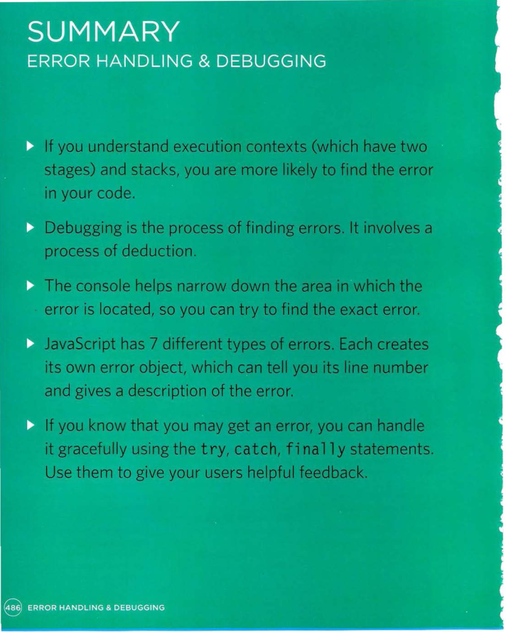

# Error Handling & Debugging

## ORDER OF EXECUTION

- To find the source of an error, it helps to know how scripts are processed.
The order in which statements are executed can be complex; some taskscannot complete until another statement or function has been run

- The JavaScript interpreter uses the concept of execution contexts.
There is one global execution context; plus, each function creates a new
new execution context. They correspond to variable scope.

- EXECUTION CONTEXT
JavaScript
Hello Molly
Every statement in a script lives in one of three
execution contexts:

1. GLOBAL CONTEXT
Code that is in the script, but not in a function.
There is only one global context in any page.
2. FUNCTION CONTEXT
Code that is being run within a function.
Each function has its own function context.
3. EVAL CONTEXT (NOT SHOWN)
Text is executed like code in an internal function
called eval {) (which is not covered in this book).

- VARIABLE SCOPE
The first two execution contexts correspond with the
notion of scope (which you met on p98):

1. GLOBAL SCOPE
If a variable is declared outside a function, it can
be used anywhere because it has global scope.
If you do not use the var keyword when creating
a variable, it is placed in global scope.
2. FUNCTION-LEVEL SCOPE
When a variable is declared within a function,
it can only be used within that function. This is
because it has function-level scope.

## THE STACK

## EXECUTION CONTEXT & HOISTING

- Each time a script enters a new execution context, there are two phases
of activity:

1. PREPARE :  
• The new scope is created  
• Variables, functions, and arguments are created  
• The value of the this keyword is determined

2. EXECUTE :  
• Now it can assign values to variables  
• Reference functions and run their code  
• Execute statements  

## UNDERSTANDING SCOPE

- In the interpreter, each execution context has its own vari ables object.
It holds the variables, functions, and parameters available within it.
- Each execution context can also access its parent's v ari ables object

## UNDERSTANDING ERRORS

- If a JavaScript statement generates an error, then it throws an exception.
At that point, the interpreter stops and looks for exception-handling code.

## ERROR OBJECTS

- Error objects can help you find where your mistakes are
and browsers have tools to help you read them.

## ERROR OBJECTS CONTINUED

## HOW TO DEAL WITH ERRORS

- Now that you know what an error is and how the browser treats them,
there are two things you can do with the errors.

1. DEBUG THE SCRIPT TO FIX ERRORS
2. HANDLE ERRORS GRACEFULLY

## A DEBUGGING WORKFLOW

- Debugging is about deduction: eliminating potential causes of an error.
Here is a workflow for techniques you will meet over the next 20 pages.
Try to narrow down where the problem might be, then look for clues.

### WHERE IS THE PROBLEM?

First, should try to can narrow down the area where
the problem seems to be. In a long script, this is
especially important.

1. Look at the error message, it tells you: 
• The relevant script that caused the problem. 
• The line number where it became a problem for
the interpreter. (As you will see, the cause of
the error may be earlier in a script; but this is the
point at which the script could not continue.) 
• The type of error (although the underlying cause
of the error may be different). 
2. Check how far the script is running.
Use tools to write messages to the console to tell
how far your script has executed.
3. Use breakpoints where things are going wrong.
They let you pause execution and inspect the values
that are stored in variables.

### WHAT EXACTLY IS THE PROBLEM?

Once you think that you might know the rough area
in which your problem is located, you can then try to
find the actual line of code that is causing the error. 

1. When you have set breakpoints, you can see if the
variables around them have the values you would
expect them to. If not, look earlier in the script.
2. Break down I break out parts of the code to test
smaller pieces of the functionality. 
• Write values of variables into the console. 
• Calrfunctions from the console to check if they
are returning what you would expect them to. 
• Check if objects exist and have the methodsI
properties that you think they do. 
3. Check the number of parameters for a function, or
the number of items in an array

## BROWSER DEV TOOLS & JAVASCRIPT CONSOLE

- The JavaScript console will tell you when there is a problem with a script,
where to look for the problem, and what kind of issue it seems to be.

- The JavaScript console is just one of several developer tools that are
found in all modern browsers

### BREAKPOINTS

- you can pause the execution of a script on any
line using breakpoints. Then you can check the
values stored in variables at that point in time.

## STEPPING THROUGH CODE

- If you set multiple breakpoints, you can step
through them one-by-one to see where values
change and a problem might occur

## CONDITIONAL BREAKPOINTS

- You can indicate that a breakpoint should be
triggered only if a condition that you specify is
met. The condition can use existing variables.

## DEBUGGER KEYWORD

- You can create a breakpoint
in your code using just the
debugger keyword.

## HANDLING EXCEPTIONS

- If you know your code might fail, use try, catch, and finally.
Each one is given its own code block.

## THROWING ERRORS

- If you know something might cause a problem for your script, you can
generate your own errors before the interpreter creates them.

- To create your own error, you use the following line:
throw new Error( 'message ' ) ;

### THROW ERROR FOR NaN

## DEBUGGING TIPS

## COMMON ERRORS

