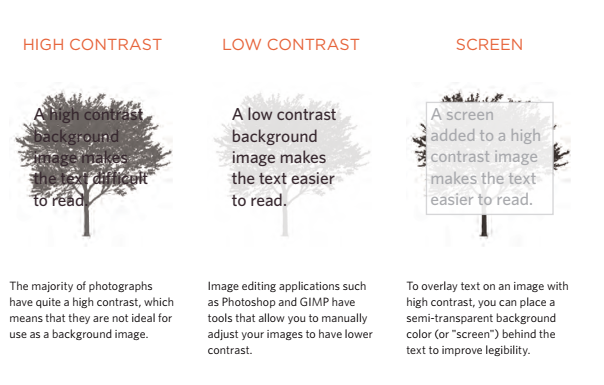
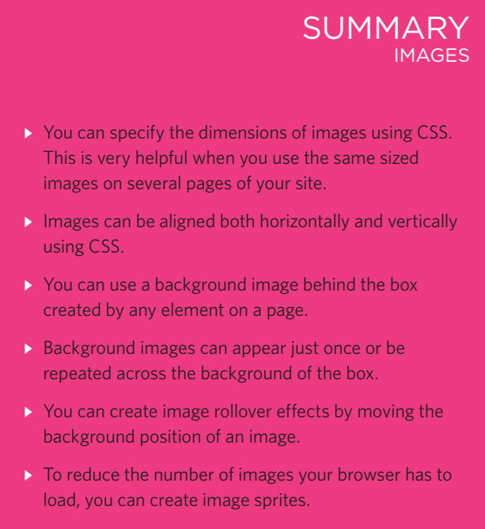
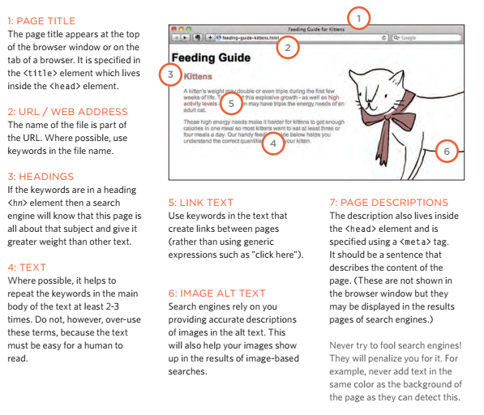
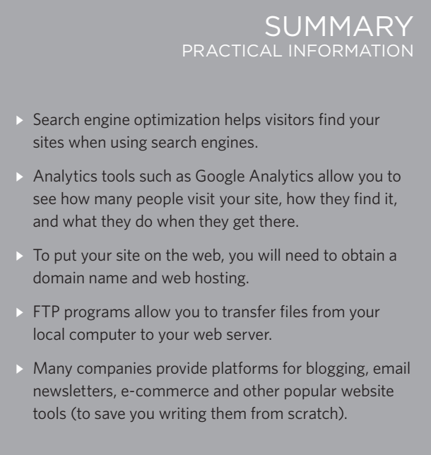

# Images

## controllIng sIzes of Images In css

- You can control the size of an
image using the width and
height properties in CSS

## AlIgnIng Images using css

- Rather than using the img
element's align attribute, web
page authors are increasingly
using the float property to align
images. There are two ways that
this is commonly achieved:

1. The float property is added
to the class that was created to
represent the size of the image
(such as the small class in our
example).
2. New classes are created with
names such as align-left or
align-right to align the images
to the left or right of the page.

## centerIng Images in css

- By default, images are inline
elements. This means that they
flow within the surrounding text.
In order to center an image, it
should be turned into a blocklevel element using the display
property with a value of block.

## BackgroUnd Images

- The background-image
property allows you to place
an image behind any HTML
element. This could be the entire
page or just part of the page. By
default, a background image will
repeat to fill the entire box.

## repeatIng Images

- The background-repeat
property can have four values:

1. repeat
The background image is
repeated both horizontally and
vertically (the default way it
is shown if the backgroundrepeat property isn't used).
2. repeat-x
The image is repeated
horizontally only (as shown in
the first example on the left).
3. repeat-y
The image is repeated vertically
only.
4. no-repeat
The image is only shown once.
The background-attachment
property specifies whether a
background image should stay in
one position or move as the user
scrolls up and down the page. It
can have one of two values:
5. fixed
The background image stays in
the same position on the page.
6. scroll
The background image moves
up and down as the user scrolls
up and down the page.

## BackgroUnd posItIon

- When an image is not being
repeated, you can use the
background-position
property to specify where in the
browser window the background
image should be placed.

## shorthand

- The background property acts
like a shorthand for all of the
other background properties
you have just seen, and also the
background-color property.

## Image rollovers & sprItes

- Using CSS, it is possible to create
a link or button that changes to a
second style when a user moves
their mouse over it (known as a
rollover) and a third style when
they click on it.

## gradIents

- CSS3 is going to introduce the
ability to specify a gradient for
the background of a box. The
gradient is created using the
background-image property
and, at the time of writing,
different browsers required a
different syntax.

## contrast of BackgroUnd Images

- If you want to overlay text on a background image, the image must be low
contrast in order for the text to be legible.

# Practical Information

## search engine oPtimization (SEO)

- SEO is a huge topic and several books have been written on the subject.
The following pages will help you understand the key concepts so you can
improve your website's visibility on search engines.

1. the Basics
Search engine optimization (or
SEO) is the practice of trying
to help your site appear nearer
the top of search engine results
when people look for the topics
that your website covers.
2. on-Page techniques
On-page techniques are the
methods you can use on your
web pages to improve their
rating in search engines.
3. off-Page techniques
Getting other sites to link to you
is just as important as on-page
techniques. Search engines help
determine how to rank your
site by looking at the number of
other sites that link to yours.

## on-Page seo

- In every page of your website there are seven key places where keywords
(the words people might search on to find your site) can appear in order
to improve its findability.

## HOW to identify keyWords and Phrases

- Determining which keywords to use on your site can be one of the
hardest tasks when you start to think about SEO. Here are six steps that
will help you identify the right keywords and phrases for your site.

1. Brainstorm
List down the words that
someone might type into
Google to find your site. Be sure
to include the various topics,
products or services your site is
about.
2. organize
Group the keywords into
separate lists for the different
sections or categories of your
website
3. research
There are several tools that let
you enter your keywords and
then they will suggest additional
keywords you might like to
consider, such as:
adwords.google.co.uk/
select/KeywordToolExternal
(When using this tool, select the
"exact match" option rather than
"broad match.")
4. comPare
It is very unlikely that your
site will appear at the top of
the search results for every
keyword. This is especially true
for topics where there is a lot
of competition. The more sites
out there that have already been
optimized for a given keyword,
the harder it will be for you to
rise up the search results when
people search on that term.
5. refine
Now you need to pick which
keywords you will focus on.
These should always be the ones
that are most relevant to each
section of your site.
6. map
Now that you have a refined list
of keywords, you know which
have the most competition, and
which ones are most relevant,
it is time to start picking which
keywords you will use for each
page.

## analytics: learning aBout your Visitors

- As soon as people start coming to your site, you can start analyzing
how they found it, what they were looking at and at what point they are
leaving. One of the best tools for doing this is a free service offered by
Google called Google Analytics.

1. signing uP
The Google Analytics service
relies on you signing up for an
account at:
www.google.com/analytics
The site will give you a piece of
tracking code which you need to
put on every page of your site.
2. hoW it Works
Every time someone loads a
page of your site, the tracking
code sends data to the Google
servers where it is stored.
3. the tracking code
A tracking code is provided
by Google Analytics for each
website you are tracking. It
should appear just before the
closing head tag. The code
does not alter the appearance of
your web pages.

## hoW many PeoPle are coming to your site?

- The overview page gives you a snapshot of the key information you are
likely to want to know. In particular, it tells you how many people are
coming to your site.

## What are your Visitors looking at?

- The content link on the left-hand side allows
you to learn more about what the visitors are
looking at when they come to your site.

## Where are your Visitors coming from?

- The traffic sources link on the left hand side
allows you to learn where your visitors are
coming from.

## domain names & hosting

- In order to put your site on the web you will
need a domain name and web hosting.

1. domain names
Your domain name is your web
address (e.g. google.com or bbc.
co.uk). There are many websites
that allow you to register domain
names. Usually you will have to
pay an annual fee to keep that
domain name.
2. WeB hosting
So that other people can see
your site, you will need to upload
it to a web server. Web servers
are special computers that are
constantly connected to the
Internet. They are specially set
up to serve web pages when
they are requested.

## ftP & third Party tools

- To transfer your code and images from your
computer to your hosting company, you use
something known as File Transfer Protocol.
- There are a wide variety of sites that offer
services commonly created by web developers
(to save you having to build them yourself).

